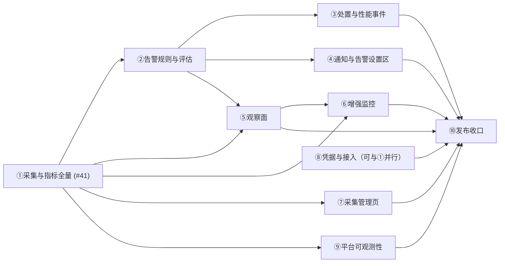

# dbs-monitor MVP 全量规格总纲（Master Spec）

> **本文档是生成物**：由十份 spec issue（片①–⑩）全文合成，语义以各 issue 为准；任一 issue 变更后需重新合成本文档。
> **用途**：作为 `/to-tickets` 的统一输入——拆票时以本文档为全局依赖上下文，按片间依赖序出票；每片一节，节内即该片 spec 全文。
> **管道**：wayfinder 地图 [#1](https://github.com/liumingjian/dbs-monitor/issues/1)（R1 产品规格）/ [#15](https://github.com/liumingjian/dbs-monitor/issues/15)（R2 架构骨架）/ [#36](https://github.com/liumingjian/dbs-monitor/issues/36)（MVP 切分）→ [S1 #37](https://github.com/liumingjian/dbs-monitor/issues/37) 十片定稿 → 十份 spec（本文档）→ `/to-tickets` → `implement-issues`。

---

## 一、从零全貌：项目是怎么走到这里的

**产品**：PostgreSQL 私有化监控平台——离线 tar 整包交付（自带 PG17），Go 单服务端 + 每实例一个 Agent（只采 OS 指标与心跳），TS/React SPA 经 `go:embed` 打入主二进制。目标规模 ~50 实例，PG-only（13–17），单租户内网。

**R1（产品/设计规格，地图 #1，已冻结）**：R1 字典 32 项 P0 指标与口径（`01`）、告警五状态机与压制正交（`02`）、页面树与统一状态模型（`03`）、十项 ADR 与四条跨文档不变式（`00`）。四条不变式：告警五档压制正交；实例健康 = 未恢复告警最坏归并 + 已暂停 override，单一来源；三档全局角色、可见性不收窄写能力收窄、凭据永不回显；三条内置采集状态规则不可删不可停、severity 下限 warning。

**R2（架构骨架与技术选型，地图 #15，已冻结）**：存储窄表按天分区（`04`）、四层偏序与封闭接缝白名单（`05`）、字典编译进 Go + Task 一等公民 + 能力四态（`06`）、OpenAPI 单一契约源 + 封闭 13 码空状态（`07`）、AntD 6 + ECharts 6 + TanStack 三状态桶（`08`）、离线 tar + socket-only 自建 PG（`09`）、两层验证闭环 `make check`(≤120s)/`make check-full`（`10`）、并发/超时/背压（`12`）、keyring 凭据加密（`13`）、平台自身可观测性独立四态（`14`）、CI 与发布流水线（`15`）。索引见 `16`。

**已交付基线（T11 walking skeleton，已合并 main——以下能力「已交付，仅验证」，拆票跳过）**：

- 两条采集通路走通：服务端直连（探针 + 连接数）与 Agent push（真 TLS、真令牌、±30s 拒收）；
- 一条硬编码告警规则走通五状态机（含 NO_DATA 与滞回 RECOVERED），独立评估循环错相位，读样本写状态同事务；
- 前端两级路由 + `validateSearch` 时间范围、一张经 `unavailability` 必填领域组件渲染的图、13 码空状态壳、登录页与 401 全局处理；
- 按天分区 + 预建 + 滚动删除；goose 自动迁移；`make check` / `make check-full` 两层闭环与 B 栏守卫；CI PR 门 + 默认分支 workflow；离线 tar 安装与首启人工验收通过。

**已登记欠账（由对应片偿还）**：凭据明文存库 + 创建实例回显令牌（→⑧）；Agent 补报缓冲与版本协商（→①）；采集串行无背压（→①）；10 个空状态码后端不产出（→①⑦⑧）；AntD 观感门未判定（→⑤）；升级/回滚与 PG13–17 矩阵接线（→⑩）。

**切分（地图 #36 + S1 #37，已收口）**：剩余 MVP 按领域垂直切十片，每片 = 一份 `/to-spec` 产出；发布验证欠账独立收尾成片；迁移欠账归所属域片。

## 二、十片总表

| 片 | Spec issue | 一句话边界 | 完成判据（gist） | 依赖 |
|---|---|---|---|---|
| ① 采集与指标全量 | [#41](https://github.com/liumingjian/dbs-monitor/issues/41) | R1 字典全量 + 能力四态 + Task 计划入库 + T12 并发背压 + 慢查询采样 + Agent 补报/版本协商 | 全部指标经真实 Task 产出样本或显式降级；矩阵断言随写全绿；三条派生指标可评估 | — |
| ② 告警规则与评估 | [#42](https://github.com/liumingjian/dbs-monitor/issues/42) | 规则 CRUD / 版本快照 / 只读模板 / 内置三规则 / NO_DATA 策略 / 滞回配置 | ADR-03 全语义走通；三内置规则装机即在不可删不可停 | ① |
| ③ 告警处置与性能事件 | [#43](https://github.com/liumingjian/dbs-monitor/issues/43) | 确认/忽略 / 触发现场快照 / 性能事件派生 + 知识模板 | 处置可切换留痕；快照首次 FIRING 一次 + 截断契约；事件可用 | ② |
| ④ 通知与告警设置区 | [#44](https://github.com/liumingjian/dbs-monitor/issues/44) | SMTP+Webhook / 联系人 / 策略默认+覆盖 / repeat+退避留痕 / 维护窗口 | 四页齐；通知端到端可达、失败三次退避留终态；窗口只压通知不断评估 | ② |
| ⑤ 观察面 | [#45](https://github.com/liumingjian/dbs-monitor/issues/45) | 实例列表 + 工作台页签 + 全局告警；AntD 观感门 = 早期验收门 | 页面树全部可用；13 码空状态后端真实驱动；AntD 门已判定 | ①② |
| ⑥ 增强监控 | [#46](https://github.com/liumingjian/dbs-monitor/issues/46) | 5 秒管线读取端 + 页签（30 分钟/5 秒/平均/两列） | 基线四要素可用；能力不足局部降级显示原因 | ①⑤（spec 前置 E1 [#39](https://github.com/liumingjian/dbs-monitor/issues/39)，已清） |
| ⑦ 采集管理页 | [#47](https://github.com/liumingjian/dbs-monitor/issues/47) | 暂停采集（冻结/解冻不回放）+ 配置缺失待办三态 + 暂停期历史保留 | 暂停全语义成立；待办不报假绿、永不隐藏、正向空状态带检查时间 | ① |
| ⑧ 凭据与接入 | [#48](https://github.com/liumingjian/dbs-monitor/issues/48) | keyring / 明文列迁移 / B7 令牌例外迁移 / Agent 登记与令牌 UI / 接入页 / 用户角色页 | 两笔迁移完成且旧路径删除；S2 两页语义全落地 | S2 [#38](https://github.com/liumingjian/dbs-monitor/issues/38)（已清），可与①并行 |
| ⑨ 平台可观测性 | [#49](https://github.com/liumingjian/dbs-monitor/issues/49) | 平台独立四态 / journal / 诊断 API / 磁盘紧急拒写 | 平台健康与目标告警彻底隔离；紧急拒写可证且不删旧数据 | ①（完整性水位） |
| ⑩ 发布收口 | [#50](https://github.com/liumingjian/dbs-monitor/issues/50) | upgrade.sh / 备份回滚演练 / 矩阵接线 / 发布线余段 / appendix / Unavailability 全表验收 | 干净机器装-升-回滚通过；流水线全绿出包；应产出的码全部可产出 | 全部 |

## 三、片间依赖图

## 四、跨片原则（S1 拍板，拆票时全局适用）

1. **PG13–17 矩阵**：形状断言随片①各 Task 同步写；片⑩只接线进 `check-full` / release gates——不得留到片⑩补断言。
2. **Unavailability 13 码分摊**：哪片让该码产生条件成真，哪片负责后端真实产出——11 码归①、`COLLECTION_PAUSED` 归⑦、`VERSION_UNSUPPORTED` 归⑧（接入即拒）；片⑩全表验收。
3. **窄接缝不连片级依赖**：「确认停止重复通知」读处置状态（④→③）、「已忽略退出健康归并」读忽略标记（⑤→③）、三条派生指标取数（②→①）、密钥类故障事实（⑨→⑧）等——spec 里注明接缝，由 `/to-tickets` 在**票级**处理。
4. **测试接缝**：九片仅新增一个接缝 `notify.Channel`（片④，T5 §5 预授权）；其余全部复用既有四接缝（`clock.Clock` / `pgconn.Dialer` / `collect.Collector` / `DBTX`）与三种既有测试形态（纯函数表驱动 / 真库集成 / Playwright+matrix）。
5. **强制测试登记表**（`10` §3.2）：A1–A3（②）、A4（⑦）、A5（⑤）、A7/A8（①）触及时先红后绿；A9 golden 随②扩展三内置规则。

## 五、`/to-tickets` 使用说明

- 以本文档整体为输入做**全局依赖规划**，出票仍按片分批、按依赖序：①（已具备）→ ②/⑦/⑨/⑧（⑧可更早）→ ③/④/⑤ → ⑥ → ⑩。
- 每片一批 tracer-bullet 票，票间只连真依赖（`implement-issues` 是动态重规划背包模型，不造串行）。
- 「已交付，仅验证」标注的内容**不出实现票**，最多出验证票。
- 每会话最多 resolve 一张票的纪律不变。

---

# 以下为十片 spec 全文（按依赖序收录）

---

# 片① · 采集与指标全量（[#41](https://github.com/liumingjian/dbs-monitor/issues/41)）

> **管道**:wayfinder 地图 [#36](https://github.com/liumingjian/dbs-monitor/issues/36) → 本 spec(`/to-spec`)→ `/to-tickets` → `implement-issues`。片表、完成判据与依赖图见 [S1 #37 resolution](https://github.com/liumingjian/dbs-monitor/issues/37);本片为首发片,无片级前置依赖。
> **冻结决策引用**(语义全部已冻结,本 spec 只落位不重议;推翻须新开决策记录):`01`(R1 字典 v1.0)、`04`(存储模型)、`06`(字典载体与采集计划)、`07`(API 契约)、`12`(并发/超时/背压)、`16`(R2 索引)、[T1 #19](https://github.com/liumingjian/dbs-monitor/issues/19)、[T3 #21](https://github.com/liumingjian/dbs-monitor/issues/21)。

## Problem Statement

运维人员接入一个 PostgreSQL 实例后,目前只能看到 3 项硬编码指标(连通性、总连接数、CPU),远不是 R1 规格承诺的 32 项 P0 指标。指标没有数据时,页面无法回答「为什么没有」:是监控账号缺 `pg_monitor`,是扩展未装,是备库指标在主库上本来就不适用,还是采集真的失败了——所有缺数在用户眼里长一个样。监控系统自身在目标库缓慢或平台过载时的行为也不可预期:没有超时边界、没有背压、没有退避,最脆弱的时刻反而可能被监控放大压力。Agent 侧断连即丢数据、时钟错乱的样本静默进库、版本不一致时行为未定义。

## Solution

R1 字典 32 项 P0 指标全量落地:每一项要么经真实采集任务产出样本、在实例详情图表中可选可画,要么显式降级为封闭码表中的一个可解释原因(无权限/扩展未装/结构性不适用/采集失败/暂无样本……)。能力探测按四态(PRESENT/MISSING/NOT_APPLICABLE/UNKNOWN)每 5 分钟原子刷新,「查不到」永远不会被冒充成「具备」或「不适用」。采集在 T12 定死的并发模型下运行:健康时买得起 5 秒粒度,不健康时每一次自我保护(跳过/退避)都留下可解释的事实,绝不补跑、不降频、不造占位样本。慢查询采样任务同步产出长查询指标与采样定位记录(无 SQL 文本)。Agent 采齐 7 项主机指标,断连补报 5 分钟内存窗口,时钟偏移超限拒收,新旧版本共存有明确规则。「实例连通性」「数据过期」「Agent 离线」三条采集状态派生指标就位,供片②的内置规则直接评估。

## User Stories

1. 作为只读运维,我想在实例详情图表中选择字典里任意一项 P0 指标并看到曲线,以便用 R1 承诺的完整指标面排查问题。
2. 作为只读运维,当某指标没有曲线时,我想看到具体原因(暂无样本 / 范围内无数据 / 数据过期 / 采集失败 / 数据库不可达 / 无权限 / 扩展未装 / 不适用……),以便知道该等待、换时间范围还是找管理员修配置。
3. 作为只读运维,我想让主库上的复制延迟类指标显示「本实例为主库,不适用」而不是报错或空白,以便不把拓扑事实误读成故障。
4. 作为只读运维,我想让「无 replication slot」显示为「不适用」,与真实的积压 0 字节严格区分,以便不漏判 slot 积压。
5. 作为平台管理员,我想看到能力粒度的缺失事实(如「缺少 `pg_monitor` 角色——影响 6 项指标」)及文字修复指引,以便一次修复解决一批指标(待办清单页面归片⑦,本片产出其全部数据事实)。
6. 作为平台管理员,当能力探测本身失败时,我想看到「未知」而不是一份空的缺失清单,以便不把「看不见」误读成「没问题」。
7. 作为平台管理员,我想调整某个采集任务的采样周期(下限 5 秒),并确认 UI 显示的周期永远是我配置的值——系统因故障退避时须另行明示,以便配置与实际行为不分裂。
8. 作为告警管理员,我想让「实例连通性」「数据过期」「Agent 离线」三条派生指标有真实、单一来源的数据,以便片②的三条不可停用内置规则装机即可评估。
9. 作为客户 DBA,我不希望监控系统在数据库最脆弱时放大压力:失败不立即重试、过载不排队补跑、退避封顶 60 秒、监控连接固定 `application_name` 且每实例至多一条普通查询连接。
10. 作为客户 DBA,我想让「新客户端此刻能否连上」的探针语义永不退化:探针每次新建连接、永不退避,即使已有旧连接仍可查询,两个事实分别保留。
11. 作为只读运维,我想看到长查询数量指标,并能查看采样定位信息(PID、状态、等待事件、时长等,不含 SQL 文本),以便拿着线索去库上排查(下钻页面归片⑤,本片落样本与读接口)。
12. 作为只读运维,我想在扩展可用时看到查询统计快照(原生 queryid 等上下文),扩展未装时看到明确的降级原因,以便机会性地用上 `pg_stat_statements`(排行页面归片⑤)。
13. 作为交付工程师,我想让 Agent 采齐 CPU、内存、磁盘使用率/剩余/IOPS/吞吐、网络流量 7 项主机指标,以便主机侧监控不是残缺的。
14. 作为交付工程师,我想让 Agent 网络抖动断连后把最近 5 分钟的样本随重连补报,超窗丢弃且绝不落盘,以便曲线少断而 Agent 永不写满数据库主机磁盘。
15. 作为交付工程师,我想让时钟偏移超过 ±30 秒的上报被拒收并把 Agent 置为 error(原因「时钟偏移」),以便时钟错乱的样本不污染时间轴、不骗过缺数判定。
16. 作为交付工程师,我想在服务端先升级后让旧 Agent(前一大版本内)继续上报,并能看到每台 Agent 的版本号,以便分批上机升级时监控不中断且知道还剩几台没升。
17. 作为交付工程师,我想让过老的 Agent 被明确拒收并报「版本过旧,需升级」,而不是静默异常,以便升级窗口内的问题可定位。
18. 作为平台管理员,我想让平台过载导致的采集跳过与目标库故障在事实上可区分(跳过不写 `reachable=false`、细因可查),以便不把平台问题误判成数据库事故。
19. 作为告警管理员,我想让「数据过期」以完整性水位为准——任一该采的任务没采成,水位就不推进,以便一个健康的高频任务永远掩盖不了另一个持续失败的任务。
20. 作为后续片的实现者(②⑤⑥⑦),我想让本片交付的样本、能力快照、任务状态、采样记录各有唯一真相源和稳定读取契约,以便下游不需要二次推导。

## Implementation Decisions

以下按冻结文档落位;标注「**本片决策**」的是 S1 授权留给 spec 的参数级/落位级决策,其余均为既有冻结语义的引用。

**字典载体与任务(`06`)**
- 口径半以 Go 声明编译进二进制(L1 指标包),双表模型 `Task` / `Metric` + 封闭 `Capability` 枚举;计划参数(任务周期、Agent 指标开关)入库。代码里不得出现第二处指标常量——现存于迁移 CHECK 约束、OpenAPI 枚举、handler 单位映射三处的重复指标清单一律收敛为由字典生成或断言一致。
- 服务端 Task 约 7 条(探针 / `pg_stat_database` / `pg_stat_activity` / 复制 / slot / 2PC / 角色),每 Task 单一 SQL、无版本变体(PG13–17 内无差异);有增强候选的任务周期 5s,纯标准任务 30–60s,低频任务 5m,周期归并取快者。
- **本片决策**:慢查询采样与 `pg_stat_activity` 指标产出共用同一 Task 的同一次快照——一次查询同时产出 7 项指标与超过长查询阈值的采样记录,不发第二次查询,避免指标与采样记录两个真相源在时间上错位。
- **本片决策**:机会性查询统计快照单设一条 Task(`Requires: ext.pg_stat_statements`),产出 queryid 级快照记录供片⑤排行;能力缺失时整任务不执行,原因进空状态。它不产出任何 P0 指标,字典一致性测试范围不含它的「指标」列。
- Agent 的 7 项 `host.*` 无服务端 Task,仅作 `Metric` 声明存在;Agent 指标集编译期固定,不读字典、不下发采集清单。

**能力探测(`06` §4、`12` D6)**
- 封闭能力枚举含 `Class`(fixable/structural)、`Probe`、`FixHint`、`NAReason`;P0 所需能力至少:`role.pg_monitor`(fixable)、`ext.pg_stat_statements`(fixable)、`topo.has_replication`(structural)、`topo.has_slot`(structural)。「影响 N 项指标」沿 `Task.Requires` 反查,不建第二张映射表。
- 5 分钟独立循环、每实例原子快照:整组成功才提交 PRESENT/MISSING/NOT_APPLICABLE,任一失败提交整份 UNKNOWN;快照超 5 分钟有效期由读取侧投影为 UNKNOWN。查询报错永不反推能力。
- 任一 `Requires` 不为 PRESENT 即不执行任务,原因作为其全部产出指标的空状态原因。

**调度、超时、背压(`12` 全文)**
- 中央调度器按 `(instance, task, due_at)` 调度,确定性错峰;每实例探针/非探针双槽;全局默认上限各 32(部署期配置,不进 UI)。
- 探针每次新建连接、3s 硬期限、永不退避;普通任务每实例 `MaxConns=1` 懒池、`min(80%×interval, 10s)` 期限、客户端 deadline 与 `statement_timeout` 双保险;背压 latest-only 合并,不补跑、不自动降频、不造占位样本;退避 1×→2×→4×interval 封顶 60s,连接级/任务级分开。
- 每 `(instance, task)` 状态持久化(到期/开始/结束/成功时间、最近结果五枚举、连续失败数、`next_eligible_at`、脱敏错误);`collector.last_success_time` = 采集源完整性水位,全部当前义务满足才推进。

**存储(`04`)**
- 样本一律进既有 `metric_sample`(线 1:`reachable`、`replication.role`、`connection_state` 编码 float8,码表在字典载体,只增不改);`collector.last_success_time`、`agent.status` 为控制面投影,不落时序(线 2);失败原因 code+message 进控制面(线 3)。
- 差分指标写入侧差分、只存速率,COUNTER_RESET 语义沿既有速率工具;须容忍 ≤5 分钟乱序写入且不触发 reset 误判(T3 D6 下游约束,含 Agent 补报与 IOPS/吞吐差分)。
- **本片决策**:新增控制面表——能力快照、任务计划参数、每任务状态、会话采样记录、查询统计快照。会话采样与查询统计记录随样本同窗保留(30 天,不单独可配),每次采样落库行数有上界(参数在 /to-tickets 定),记录含定位字段但**永不含 SQL 文本**(ADR-06)。

**Agent(T3 D6/D7)**
- 采齐 7 项 `host.*`;时间戳由 Agent 打;±30s 偏移拒收整批并置 `agent.status=error`;补报限 5 分钟内存窗口,不落盘;补报样本只进图表与历史,不重放告警评估。
- 每次上报携带 `agent_version`,服务端记录;版本下限为当前大版本的前一个,低于下限拒收并明确报错;JSON 字段只增不改不删,双侧忽略未知字段。

**API(`07`)**
- 指标序列端点的指标枚举扩到全字典(枚举由字典单一来源保证一致);空状态一律 200 + 封闭 13 码;时间绝对化、缺桶不补 0 等既有契约不变。
- **本片决策**:采集域契约新增只读端点——每实例能力快照(四态+observed_at+FixHint/NAReason)、每实例每任务采集状态(供⑦管理页与排障)、会话采样记录与查询统计快照读取(供⑤下钻/排行);写端点仅任务周期配置(`x-required-role` 平台管理员)。页面 UI 均不在本片。
- Unavailability 落位:本片使 `NO_SAMPLES_YET` / `NO_DATA_IN_RANGE` / `STALE` / `COLLECTION_FAILED` / `DB_UNREACHABLE` / `AGENT_OFFLINE` / `PERMISSION_DENIED` / `EXTENSION_MISSING` / `FEATURE_DISABLED` / `NOT_APPLICABLE_ROLE` / `COUNTER_RESET` 十一码可被后端真实产出;`COLLECTION_PAUSED` 归片⑦;`VERSION_UNSUPPORTED` 在 P0 无产生者(PG12 接入即拒属片⑧的接入校验),片⑩全表验收时按此对账。

**版本矩阵(`06` §5.5,S1 跨片原则)**
- 每落一条 Task,同步写 PG13–17 形状断言(列名、类型、行形状 = `Task.Yields`);启用既有 compose `matrix` profile(五版本真库),新增独立 make target 本地可跑全绿;CI / release gates 接线归片⑩。

**前端**
- 既有实例详情图表页经生成类型自动获得全字典指标可选;13 码降级文案组件已备。观察面页面树、页签、待办清单 UI 全部归片⑤⑦,本片前端仅保证「任选字典指标→出曲线或出原因码」这条 tracer bullet 走通。

## Testing Decisions

- 好测试只断言外部行为:样本、状态、原因码经 API 或库表事实验证;不断言调度器内部实现细节(goroutine 结构、队列形态)。
- **快层(`go test`,预算 ≤120s 内)**:字典↔`01` §3 表一致性测试与恰好一次产出测试(`06` §2.1/§3.3 两条强制测试);枚举穷尽(既有守卫自动覆盖新增枚举);调度器 12 条守卫(`12` §11)用既有白名单接缝 `clock` + 采集 `Dialer` 做确定性测试,不造 mock、不新增接缝;差分/reset、能力四态投影等语义按强制测试登记表(`10` §3.2)表驱动、先红后绿——先例:告警状态机表驱动测试。
- **集成层(真库,沿既有一次性库模式)**:真实 Task 端到端(采集→样本→API 查询);能力循环四态与原子快照;完整性水位;慢查询采样落库与读取;Agent 上报含补报乱序、偏移拒收、版本下限拒收(打真实上报 handler)。
- **矩阵层(compose `matrix` profile)**:五版本 × 全部 Task 形状断言,独立 target,本片内全绿;不入快层预算。
- **e2e**:沿既有 Playwright 骨架补一条「任选字典指标出曲线/出原因码」。
- 测试所在层级以 `make check` ≤120s 预算为准绳分层;矩阵与容量类永不进快层。

## Out of Scope

- 告警评估与规则 CRUD、三条内置规则的装机与不可停用语义(片②——本片只保证其取数就位)。
- 处置、触发现场快照、性能事件(片③);通知与告警设置区(片④)。
- 观察面页面树、13 码空状态的 UI 验收、慢查询下钻页、查询统计排行页(片⑤);增强监控页签 UI(片⑥——采集层 5s 管线本片已含,共用管线无第二套)。
- 暂停采集全语义与 `COLLECTION_PAUSED` 产出、配置缺失待办 UI(片⑦——本片产出其数据事实与窄接缝)。
- keyring 与明文口令迁移、Agent 令牌生命周期、实例接入页与 PG 版本门拒收(片⑧);平台自身可观测性四态/journal/诊断 API(片⑨——`12` D8 边界不越)。
- `01-appendix-implemented.md` 生成、矩阵接线 check-full/release gates、Unavailability 全表验收(片⑩)。
- 降采样、保留分层、用户自定义指标/SQL 探针、Task 版本变体机制(冻结否决,不得复活)。

## Further Notes

- **验收判据(S1 拍板,原文)**:字典全部指标经真实 Task 产出样本或显式降级;PG13–17 形状断言随各 Task 同步落地全绿;三条采集状态派生指标可被评估。
- **窄接缝(S1 定为票级,`/to-tickets` 处理,不连片级依赖)**:⑦暂停标志在调度器与水位的判定点;⑤会话采样/查询统计读取契约;②三条派生指标取数路径。
- 采集连接目前 `sslmode=disable` 且口令明文,属骨架已知欠账,修复归片⑧(`13` 决策);本片沿既有 Dialer 接缝,不预实现 keyring。
- 存储量基线 ~25M 点/天、30 天 ~40 GB(`06` §6),低于 RT-C 门槛;实测击穿才回改,本片不做保留分层。
- 每会话最多 resolve 一张票的纪律不变;实现票由 `/to-tickets` 从本 spec 切出。

---

# 片② · 告警规则与评估（[#42](https://github.com/liumingjian/dbs-monitor/issues/42)）

> **管道**：wayfinder 地图 [#36](https://github.com/liumingjian/dbs-monitor/issues/36) → 本 spec（`/to-spec`）→ `/to-tickets` → `implement-issues`。片表、完成判据与依赖图见 [S1 #37 resolution](https://github.com/liumingjian/dbs-monitor/issues/37)；本片依赖：片①（[#41](https://github.com/liumingjian/dbs-monitor/issues/41)）。
> **冻结决策引用**（语义全部已冻结，本 spec 只落位不重议；推翻须新开决策记录）：`02`（告警规则模型 v1.0 全文）、`00` ADR-03/ADR-07/ADR-08、`04`（存储模型 §8.2）、`05`（后端结构 §2.3/§6）、`07`（API 契约）、`10`（护栏 §3.2）、`11`（骨架切片 D2）、`16`（R2 索引）、[T3 #5](https://github.com/liumingjian/dbs-monitor/issues/5)、[T7 #10](https://github.com/liumingjian/dbs-monitor/issues/10)、[T8 #11](https://github.com/liumingjian/dbs-monitor/issues/11)。

## Problem Statement

运维人员今天完全无法配置告警：骨架里只有一条硬编码规则（对 `pg.connection.total`），不可见、不可改、不可停。R1 承诺的整套基础告警——任选可告警指标建规则、内置模板一键创建、强制滞回恢复、NO_DATA 两档策略、规则版本快照——一项都没有用户入口。最要命的是 ADR-07 花整条路线堵死的静默事故此刻仍是现实：`NO_DATA` 本身不通知，而承担缺数告警通路的三条内置采集状态规则尚未真正装机评估——数据库挂了、Agent 掉了、采集停了，平台一声不吭。片①已让全字典指标与三条采集状态派生指标产出真实、单一来源的数据，但没有任何规则模型去消费它们。

已交付基线（T11 walking skeleton，**已交付，仅验证，拆票跳过**）：五状态机无时间纯函数（OK→PENDING→FIRING→RECOVERED 与 NO_DATA、缺数清零计数）、独立评估循环与采集同频错相位、读样本写告警状态同事务、内置三规则的 golden 声明。本片在其上做**替换**：把硬编码规则替换为规则模型驱动的评估，替换过程不得破坏骨架端到端集成测试。

## Solution

告警管理员在实例工作台的「告警规则」页对字典中任意可告警指标创建单指标单条件规则：连续次数持续判定（UI 同时显示约合时长）、强制滞回恢复（数值规则必须显式独立恢复阈值，布尔/枚举规则反状态恢复）、NO_DATA 策略两档可选、通知策略可空即继承默认（列表回显「默认策略（继承）」）。规则修改产生版本快照，从下一次评估生效、重置未完成计数、不回放历史。内置模板只读可一键创建独立规则；三条采集状态内置规则装机 seed 即在、不可删不可停、severity 下限 warning——「数据库挂了平台一声不吭」从此在结构上不可能。评估循环改为读规则表驱动既有纯函数状态机，五状态、缺数清零、去重键全语义走通，ADR-03 全套语义可被真实配置触达。

## User Stories

1. 作为告警管理员，我想对字典中任意可告警指标（含三条采集状态派生指标）创建阈值规则（单指标单条件），以便告警面不再局限于骨架那条硬编码规则。
2. 作为告警管理员，创建有序数值规则时我必须显式配置独立恢复阈值形成滞回区间，留空即被校验拒绝，以便阈值附近波动不制造反复触发与恢复。
3. 作为告警管理员，我想让布尔/枚举状态规则用明确反状态恢复（如 `reachable=false` 触发、`=true` 恢复），以便状态告警不被强套数值阈值。
4. 作为只读运维，我想在规则页同时看到连续次数、评估周期与约合时长（如「连续 3 次 × 30 秒 ≈ 1 分 30 秒」），以便对触发时机有时间感知。
5. 作为告警管理员，我想修改一条正在 FIRING 的规则并让新配置从下一次评估生效——实例 ID 与首次触发时间保留、未完成计数重置、不回放不立即重算，以便救回一条配错的卡死告警而不让一次保存制造通知风暴。
6. 作为告警管理员，我想为规则选择 NO_DATA 策略（ignore / mark_no_data），且进入门槛固定为连续 2 个评估周期、规则级不可配，以便短暂缺数与真缺数有统一、无需我判断的口径。
7. 作为只读运维，FIRING 中的实例失联时我想让告警进入 `NO_DATA` 而不恢复、不关闭、仍计一条未恢复告警，数据恢复后回到之前状态并从零重新累计，以便「数据库不可达」擦不掉已知问题。
8. 作为告警管理员，我想基于只读内置模板一键创建规则（复制默认值，创建时可改阈值/恢复条件/连续次数/级别/范围/通知策略），创建后不跟随模板升级并记录来源模板与版本，以便快速起步且配置归我所有。
9. 作为告警管理员，我想复制一条已有规则再改参数，以便复用配置而不需要自定义模板库（冻结否决项）。
10. 作为平台管理员，我想让三条采集状态内置规则装机即在、不可删除不可停用、作用于全部实例（含此后接入的），以便任何人都关不掉缺数告警的对冲通路。
11. 作为告警管理员，我想修改内置三规则的阈值、severity（仅 warning/critical）与通知策略；把它删掉、停用或降为 info 的请求应被明确拒绝并说明理由，以便自由度与静默事故的边界清晰可见。
12. 作为只读运维，我想在规则列表看到 `02` §7.1 的全部字段——条件、级别、启停状态（内置显示「不可停用」）、生效通知策略名（继承者显示「默认策略（继承）」）、最近触发时间、当前告警数、所需能力是否满足，以便无写权限也能读懂告警面。
13. 作为告警管理员，我想启停自建规则；停用后存量未恢复告警实例原地保留、不再评估、不谎报恢复，重新启用后按下一次评估实际结果延续同一实例，以便启停不污染历史。
14. 作为客户 DBA，我想让同一规则在同一资源（含维度）上未恢复前只有一条告警实例（去重键 `rule_id + resource_id + metric_dimension`），以便持续异常不逐周期刷屏。
15. 作为只读运维，我想看见全部规则配置但写控件置灰并提示所需角色（可见性不收窄，写能力收窄），以便知道找谁改而不是找不到入口。
16. 作为后续片的实现者（③④⑤），我想让规则、规则版本快照、告警实例与状态类事件各有唯一真相源和稳定读取契约，以便处置（③）、通知触发（④）、观察列表（⑤）不需要二次推导。

## Implementation Decisions

以下按冻结文档落位；标注「**本片决策**」的是 S1 授权留给 spec 的参数级/落位级决策，其余均为既有冻结语义的引用。

**规则模型与评估语义（`02` §2/§3.1–§3.4/§5、ADR-03）**
- 单指标单条件；字段按 `02` §3.1/§3.2；持续判定只有 `consecutive_count`（`for_duration` 冻结否决）；severity 固定 critical/warning/info 三档封闭；条件的聚合与比较符按 §3.2 封闭枚举；阈值单位必须与字典一致，规则不得重定义口径（§2.1）。
- 恢复策略强制：数值规则独立恢复阈值 + 恢复连续次数（默认继承触发次数）；布尔/枚举规则反状态恢复；「留空按触发阈值隐式反向恢复」被冻结否决，校验直接拒绝。
- NO_DATA：仅 `ignore` / `mark_no_data` 两档；门槛固定连续 2 周期、平台固定不可配；缺数不推进任何状态转换并清零未完成计数；`FIRING → NO_DATA` 保持实例 ID、首次触发时间与生命周期，仍计未恢复告警；`state_before_no_data` 回跳后计数从零累计；结构性不适用不评估、不产生实例（无 Agent 登记的实例对「Agent 离线」规则即此类）。
- 去重：同一去重键未恢复前只更新既有实例，不新建。
- **本片决策**：规则 `scope` 首版两档——全部实例 / 显式多选实例集合；不做实例组、数据库级、节点级（实例分组已被 R1 划出；Agent 与实例 1:1，`host.*` 天然归实例）。内置三规则 scope 固定「全部实例」。
- **本片决策**：规则级 `evaluation_interval` 在既有单一评估循环内按到期判定实现（与采集计划周期归并同构），不开第二循环、错相位约定不变。

**规则版本快照（ADR-03 A6）**
- 保存即产生新 version；从下一次评估起采用新版本并重置未完成的触发/恢复计数；不回放、不在保存时重算；历史分别保留首次触发、当前评估、最终恢复时的规则快照；告警实例与事件记录 `rule_version`。
- **本片决策**：启停不产生新版本快照（不是条件语义变化），但记录操作人与时间；停用期间存量未恢复实例原地保留、不评估、解禁不回放——与 ADR-10 否决「强制关闭为 RECOVERED」同一理由：条件没恢复，只是不看了。

**内置规则与模板（`02` §3.9/§6、ADR-07、ADR-08 附带约束）**
- 三条内置采集状态规则装机 seed：数据库不可达（`pg.availability.reachable`，critical）、Agent 离线（`agent.status`，critical）、数据过期（`collector.last_success_time`，warning）。普通规则、走全套语义；阈值/级别/通知策略可改；受限的只有「存在与启用」；severity 取值仅 warning/critical（ADR-08：info 不改变主状态，数据库挂了列表不能仍全绿）。删除/停用/降为 info 是操作失败不是空状态，按 `07` D8 以 4xx + 封闭错误码拒绝（新增错误码只增不改）。
- 内置模板只读，`02` §6.2 全表；基于模板创建 = 复制默认值成独立规则；不做「另存为模板」/自定义模板库/模板共享（冻结否决）。
- **本片决策**：seed 幂等语义——装机与升级一律「按标识不存在才创建」，绝不覆盖用户对内置规则的修改；只读模板随平台版本整表替换（模板无用户资产）。
- **本片决策**：模板与内置三规则的默认阈值/连续次数/窗口具体数值成表在 `/to-tickets` 定；spec 只约束语义——每条模板的默认值必须满足强制滞回，内置三规则默认启用。

**通知策略绑定（ADR-09，本片只落绑定面）**
- `notification_policy_id` 可空 = 继承全局默认策略；单选、覆盖即替换；规则列表与编辑页必须回显生效策略名，继承者显示「默认策略（继承）」。
- **本片决策**：装机 seed 一个全局默认策略占位对象（仅标识与名称，满足「有且仅有一个、不可删除」），其内容、管理页与全部通知行为归片④；本片对策略对象只读引用、只回显名称。

**评估驱动（`05` §2.3/§6、`04` §8.2、`11` D2）**
- evaluator（L2）循环替换硬编码规则：读启用规则 → 按规则窗口从原始样本点取数（带时间下界，`04` §7）→ 窗口聚合与时效判定下沉 L1 纯函数 → 判定结论（满足/不满足/缺数+原因码）喂给无时间纯函数状态机 → 每实例一事务落状态与状态类事件。`clock` 止步 L2；读样本写告警状态同事务不变式不变。
- 三条派生指标取数：`pg.availability.reachable` 读样本线 1，`agent.status` 与 `collector.last_success_time` 读控制面投影（`04` 线 2 单一真相源），具体取数路径为票级窄接缝（承片① spec）。
- 本片不新增指标、不改口径、不新增采集 SQL；评估只消费片①产出。

**API 与前端（`07`、`03` 页面树）**
- `/api/v1/alert-rules` 扁平集合（D5 已列）：列表/详情/创建/修改/启停/删除；**本片决策**：新增只读扁平集合端点承载内置模板列表（全局对象，按 D5 统一律归扁平）。列表响应携带 `02` §7.1 全部展示字段。
- `x-required-role`：读端点 READONLY，规则增删改启停 ALERT_ADMIN（写权限 = 告警管理员）；校验失败走 400 `VALIDATION_FAILED` + `field_errors`；新增枚举（aggregation/operator/no_data_policy/severity 等）进封闭枚举文件并登记 Go 侧映射。
- 前端交付实例工作台「告警 → 告警规则」页：规则列表 + 创建/编辑表单 + 模板列表入口；连续次数旁必须显示约合时长；内置规则显示「不可停用」；枚举映射用穷尽 switch；无写权限控件置灰说明所需角色，不隐藏。当前告警/历史/详情页面归⑤。

## Testing Decisions

- 好测试只断言外部行为：状态迁移、实例、事件、版本快照经 API 或库表事实验证，不断言评估循环内部结构。
- **快层（`go test`，≤120s 预算内）**：alerting 纯函数表驱动扩展，沿既有告警状态机表驱动测试的先例形态，先红后绿——A1 五状态机**全部**迁移（`02` §4.2 全表，骨架现覆盖仅走通路径）、A2 滞回恢复阈值、A3 NO_DATA 连续 2 周期计数含「缺数不推进也清零未完成计数」；A9 golden 扩展覆盖三内置规则存在性与 severity 下限 warning（骨架已有 golden，本片扩展至规则模型语义与新增枚举码）。枚举穷尽、`x-required-role` 全覆盖、生成物漂移由既有 B 栏守卫自动覆盖新增端点与枚举。
- **集成层（真库，沿既有一次性库模式）**：经 API 驱动 evaluator + fake clock（既有 `clock.Clock` 白名单接缝）推评估循环——规则 CRUD 即时生效；版本快照切换（下一次评估生效、未完成计数重置、不回放、实例 ID 与首次触发时间保持）；模板只读写被拒；内置规则删除/停用/severity 低于 warning 被拒；停用规则存量实例原地保留与重启用延续同一实例；去重键下持续异常仅一条实例。
- **骨架回归门**：既有端到端集成测试（DB_UNREACHABLE → NO_DATA → RECOVERED 全链路）在硬编码规则替换为 seed 内置规则/API 创建规则后保持全绿——替换不破坏是本片的硬验收。
- **e2e（慢层）**：沿既有 Playwright 骨架补一条「创建规则 → 列表可见 → 内置规则显示不可停用与默认策略（继承）回显」。
- **无新接缝、不造 mock**；本片查询全部落平台库，不触碰被监控库，不产生新的 PG13–17 形状断言义务。

## Out of Scope

- 告警观察面：当前告警/告警历史两列表、告警详情页骨架及 13 码空状态 UI 验收（片⑤）——本片前端只交付规则管理页。
- 处置（确认/忽略与原因码）、触发现场快照、性能事件派生与知识模板、处置类事件（片③）。
- 通知策略/渠道/联系人对象管理、repeat 与退避、通知留痕、维护窗口管理页与压制标记（片④）——本片只落规则上的策略引用、默认策略占位 seed 与策略名回显。
- 三条采集状态派生指标的数据产出（片①已交付）；暂停采集的冻结语义与 A4 测试（片⑦）；实例健康归并与 A5（片⑤）。
- 冻结否决、不得复活：`for_duration`、`Silence`、`SuppressionPolicy`、`SUPPRESSED` 状态、`fire_no_data` / `recover_on_no_data`、NO_DATA 门槛规则级可配、恢复阈值留空隐式反向恢复、自定义严重级别、自定义模板库/模板共享、责任人/分派字段、多指标表达式/PromQL/动态基线、独立事件规则引擎。

## Further Notes

- **验收判据（S1 拍板，原文）**：ADR-03 全语义可走通；三内置规则装机即在、不可删不可停。
- **窄接缝（S1 定为票级，`/to-tickets` 处理，不连片级依赖）**：②三条派生指标取数路径（承片① spec 同一条）；④通知触发点读取本片落库的状态类事件与「评估事务提交后才发通知」的排队落点（`05` §4.3，本片只留结构位置不实现发送）；③⑤读取告警实例与事件的契约。
- 本片落状态类 `AlertEvent`（PENDING_STARTED/FIRED/UPDATED/RECOVERED/NO_DATA_ENTERED/NO_DATA_EXITED，含规则版本与快照字段）；处置类与通知类事件码位预留、由③④追加（枚举只增不改）。
- 告警详情的 No Data 原因展示依赖片①十一码真实产出；本片评估路径原样透传原因码进事件，不造第二来源。
- 每会话最多 resolve 一张票的纪律不变；实现票由 `/to-tickets` 从本 spec 切出。

---

# 片③ · 告警处置与性能事件（[#43](https://github.com/liumingjian/dbs-monitor/issues/43)）

> **管道**:wayfinder 地图 [#36](https://github.com/liumingjian/dbs-monitor/issues/36) → 本 spec(`/to-spec`)→ `/to-tickets` → `implement-issues`。片表、完成判据与依赖图见 [S1 #37 resolution](https://github.com/liumingjian/dbs-monitor/issues/37);本片依赖:片②(告警规则与评估,[#42](https://github.com/liumingjian/dbs-monitor/issues/42));片②依赖片① [#41](https://github.com/liumingjian/dbs-monitor/issues/41)。
> **冻结决策引用**(语义全部已冻结,本 spec 只落位不重议;推翻须新开决策记录):`02`(告警模型 §3.5/§3.6/§3.10/§4.3)、`00`(ADR-01/ADR-05/ADR-06)、`03`(IA §4.6/§4.7/§5.1)、`04`(存储与清理先例)、`07`(API 契约)、`16`(R2 索引)、[T1 #4](https://github.com/liumingjian/dbs-monitor/issues/4)、[T5 #8](https://github.com/liumingjian/dbs-monitor/issues/8)、[T6 #9](https://github.com/liumingjian/dbs-monitor/issues/9)。

## Problem Statement

片①②落地后,告警能触发、能恢复,但对运维日常最高频的两个问题——「有人在处理吗」「这算不算这台实例的问题」——平台无字段可答:值班人员无法标记「我知道了」,重复通知无法停止;误报无法退出健康归并,实例长期挂红,直到用户不再相信健康状态。证据侧更致命:锁等待、长事务类告警的会话现场往往在用户打开详情前就消失了,平台承诺的「触发现场快照」与「性能事件(原因摘要+建议动作)」完全没有代码——用户只能看到「触发了」,看不到「为什么」和「接下来做什么」。T11 骨架已交付最小 alert_instance 表与单规则评估循环(**已交付,仅验证,拆票跳过**),片②在其上扩出完整规则模型、事件表与评估语义;本片的处置字段、快照与事件派生全部为新增,在②的模型上扩展。

## Solution

确认与忽略共享一个可相互切换的处置状态,归属告警、只有一份:确认快捷(备注可选)且停止重复通知,忽略必须给出五档原因码(「其他」须补充说明)并使该告警退出实例健康归并;实例只存最后摘要,历次操作由告警事件永久留痕。四类会话现场能解释原因的告警在首次进入 FIRING 时采集一份触发现场快照:至多 100 会话、超限优先保留命中对象与完整阻塞链并记录原始匹配数与截断状态、永不含 SQL 文本、采集失败不影响触发但原因必须可见。固定清单内的告警类型触发时顺带派生实例级性能事件,事件在告警之上只叠加事件类型、按类型的只读知识模板(原因摘要+建议动作)与证据链引用;工作台性能事件页签提供触发中/已恢复/已确认已忽略/事件详情四模块,事件处置永远写回那条告警。

## User Stories

1. 作为告警管理员,我想一键确认一条 FIRING 告警并可附备注,以便团队知道有人在处理、该实例的重复通知随之停止(通知侧实现归片④)。
2. 作为告警管理员,我想忽略一条不该算实例健康问题的告警,且必须从五档原因码中选择、选「其他」时补充说明必填,以便每一次降低关注度都留下可审计依据。
3. 作为告警管理员,我想在确认与忽略之间直接切换,每次操作都追加新的处置事件而不覆盖旧记录,以便处置历史永远完整。
4. 作为只读运维,我想在告警详情看到当前处置摘要(人、时间、备注或原因)与完整处置历史,以便交接班不靠口头传递。
5. 作为告警管理员,我确认或忽略后告警仍继续评估、仍按恢复条件恢复,以便处置永远不制造假恢复。
6. 作为告警管理员,告警恢复后再次触发是新的告警实例、不继承处置状态,以便旧的「已确认」不吞掉新事故。
7. 作为只读运维,我想在锁等待/阻塞类告警详情看到触发那一刻的全部等待会话与完整阻塞链,以便现场消失后仍能定位阻塞源。
8. 作为只读运维,当快照被截断时我想看到原始匹配数与截断标识,以便知道真实现场比展示的更大。
9. 作为客户 DBA,我要求快照永不含 SQL 文本,只含 PID、等待事件、时长等原生定位信息,以便证据留存不成为敏感数据暴露面。
10. 作为只读运维,快照采集失败时告警须照常触发,详情展示失败原因而非空白,以便不把证据缺失误读成没出事。
11. 作为只读运维,对不适用快照的告警类型(不可达、主机资源、复制类等),我想看到明确的「该类型不采集现场快照」,以便不把「没有」误读成「失败」。
12. 作为只读运维,我想在实例工作台的性能事件页签按触发中/已恢复/已确认已忽略浏览事件并进入详情,以便快速回答「平台识别出了哪些异常」。
13. 作为只读运维,我想在事件详情看到按事件类型给出的原因摘要与建议动作,以便不查手册就有下一步。
14. 作为告警管理员,我在事件页做的确认/忽略写回底层告警的唯一处置状态,以便告警与事件两处永不分叉。
15. 作为只读运维,事件详情引用的快照须标注「告警触发时现场」,并能带上下文跳到告警详情与标准监控,以便证据链一路可追。
16. 作为平台管理员,告警历史(含处置事件与快照)按固定基线自动清理、未恢复告警永不被清理,以便存储可预期且审计证据不被提前删除。
17. 作为后续片的实现者(④⑤),我想让处置状态与忽略标记有唯一真相源和稳定读取契约,以便「确认停通知」「忽略退健康」在各自片内只是读取,不需要二次推导。

## Implementation Decisions

以下按冻结文档落位;标注「**本片决策**」的是 S1 授权留给 spec 的参数级/落位级决策,其余均为既有冻结语义的引用。

**处置(`02` §3.5/§4.3、ADR-05)**
- 单一处置状态落在 AlertInstance:`NONE / ACKED / IGNORED`,可相互切换;字段照 `02` §3.5(disposition、disposition_by/at/note、ignore_reason_code/detail)。实例只存最后一次摘要;历次操作以 `ACKED` / `IGNORED` 事件追加进 AlertEvent,按 `02` §3.6 记录操作人、时间、操作前后处置状态,`ACKED` 备注可选、`IGNORED` 原因码与(选「其他」时)补充说明必填——不对称是冻结的。
- 忽略原因码五档照 `02` §4.3(`已知问题,暂不处理` / `误报` / `重复告警` / `影响可接受` / `其他`);契约码值落位为 `KNOWN_ISSUE / FALSE_POSITIVE / DUPLICATE / IMPACT_ACCEPTABLE / OTHER`,封闭枚举只增不改。
- 处置事件同样保存 `02` §3.6 要求的关键快照(规则版本、指标值、阈值、评估时间等),使告警恢复、规则改版后处置历史仍自解释。
- 两种处置均不触发恢复、不停止评估、不停用规则;恢复后再触发是新实例、不继承。确认 = 停止该实例重复通知(恢复通知照发);忽略 = 退出健康归并。两个作用面的**事实**由本片落库并经契约暴露;读取方(④通知压制、⑤列表归并与呈现)是票级窄接缝。
- 不设责任人/分派字段(冻结否决)。契约上处置是独立单值字段,压制标记数组沿 `07` D9 形态由处置与窗口/暂停事实投影,不存第二份真相。

**触发现场快照(`02` §3.10、ADR-05/06)**
- 全契约照 `02` §3.10 落位:只在首次进入 FIRING 时采一次,持续评估、数值更新、处置变化均不重采,失败即终态不补采;每份至多 100 会话,超限优先保留直接命中对象与完整阻塞链,记录原始匹配数与截断状态;字段沿 `03` §4.5 会话/阻塞诊断字段,**永不含 SQL 文本**;采集失败不影响告警触发,原因必须记录并展示。
- 适用范围照 `02` §3.10 定稿表(按规则 `metric_id` 判定,自建规则与内置模板同规则一视同仁):

  | 告警类型 | 快照范围 |
  |---|---|
  | 锁等待 / 阻塞会话过多 | 触发时全部等待会话及完整阻塞链(含直接与递归阻塞源) |
  | 长事务 | 达到规则阈值的长事务会话,以及相关等待 / 阻塞关系 |
  | `idle in transaction` 过多 | 达到阈值的会话,以及它们持锁所阻塞的会话 |
  | 活跃连接数过高 | 按查询持续时间降序保存活跃会话 Top 50 |

  实例不可达、Agent 离线、主机资源、复制 / WAL / slot 类不采集(冻结)。
- 一个告警实例至多关联一份快照,`FIRED` 事件引用它;告警详情与事件详情引用同一份,不复制数据。
- 快照采集不是采集任务:不进调度器、不参与完整性水位,由评估循环在首次 FIRING 转移点同步触发,复用实例普通查询连接与既有超时纪律,失败不阻塞状态转移与事件写入。
- 契约上快照是带结果的值,三态区分:成功 / 失败(带原因)/ 该类型不适用——空状态是值不是 error,不用 404。
- **本片决策**·存储形式:控制面普通表,快照头一行+会话条目行(含阻塞关系字段),不分区、不进样本线。理由:截断契约与阻塞链完整性必须能在库层与集成测试断言(要用真库造现场),塞进 JSONB 会把契约藏进 blob;体量上限 100 行/份,可忽略。
- **本片决策**·留存与清理:告警历史保留基线 **90 天**——已恢复的告警实例连同其全部 AlertEvent 与快照,在 recovered_at 满 90 天后由每日一次的控制面清理循环删除(外键级联;用 DELETE,不建分区);未恢复实例永不清理(承 `02` §3.4 不做基于时长的自动关闭);不提供配置项(承 `02` §3.10),90 天与「样本保留 30 天」并列为发布文档声明的产品事实。取 90 天而非与样本对齐 30 天的理由:处置留痕与忽略原因是审计证据,复盘周期长于样本排障周期;触发值、阈值快照、现场快照都在告警历史里自持,样本过期后历史仍自解释;体量比样本低数个数量级,DELETE 足够,不值得第二套分区机制。

**性能事件(ADR-01、`03` §4.6)**
- 告警派生、仅实例级、零第二套引擎:事件在告警首次进入 FIRING 时派生(与快照同一钩子),每告警实例至多一条;事件行只固化派生事实(事件类型、关联告警、派生时间),状态、级别、持续时长、处置全部由告警实例投影,不复制第二份——「触发中/已恢复/已确认已忽略」是同一集合按投影的筛选。
- **本片决策**·固定派生清单(封闭枚举,只增不改):`LOCK_BLOCKING`(锁等待、阻塞会话两模板)、`LONG_TRANSACTION`、`IDLE_IN_TRANSACTION`、`ACTIVE_SESSIONS_HIGH`、`REPLICATION_LAG`(WAL 字节口径)、`TEMP_FILES_SURGE`。理由:恰好覆盖 ADR-01 点名的四类并使快照四类全部在清单内;内置采集状态三规则、主机资源、连接总数等不派生——知识模板与证据链对它们无诊断增益(与 ADR-05 排除快照的理由同构)。按规则 `metric_id` 判定,后续扩清单走枚举追加。
- 知识模板:按事件类型内置只读(原因摘要+建议动作),随平台版本更新,无编辑 UI、无用户自定义模板(承 ADR-01/`02` §3.9 的只读模板取向);渲染时以告警上下文(指标、阈值、触发值)填充,不为每个事件快照模板文本——模板是解释,证据另有快照与事件字段。
- 事件详情引用关联告警的同一份快照(不复制数据),必须标注「告警触发时现场」,不得呈现为当前状态;事件页的处置动作调用告警处置端点写回,契约上不存在第二个写入口。

**API 与页面(`07`、`03` §4.6/§4.7/§5.1)**
- 性能事件走扁平集合+详情(`07` D5 已留位),分页排序沿 D7;快照读取与处置写入嵌套在告警实例语境下。处置写端点 `x-required-role: ALERT_ADMIN`(只读运维可见但置灰并提示所需角色,承 ADR-09),全部读端点 READONLY。新增枚举(处置状态、忽略原因码、事件类型、快照结果)全部进封闭码表。
- 本片 UI:实例工作台「性能事件」页签四模块(触发中/已恢复/已确认已忽略/事件详情,字段照 `03` §4.6);告警详情页的处置区块(当前摘要+完整确认/忽略历史)与快照区块(捕获时间、成败、适用类型、会话条目、阻塞关系、原始匹配数、截断状态、失败原因)。详情页骨架归⑤,两区块为本片交付的组件,挂载顺序票级协调。跳转照 `03` §5.1:事件详情 → 标准监控(instance_id、metric_id、event_time_range)、事件详情 → 告警详情(alert_instance_id)。

## Testing Decisions

- 最高接缝 = **HTTP API 真库集成**(沿既有一次性库模式),断言外部行为不断内部实现:处置切换与留痕(断言 AlertEvent 序列);忽略原因码必填与「其他」补充说明必填校验;快照首次 FIRING 只采一次(再次评估不重采);截断契约——集成层真库构造会话现场(真事务、真锁等待构造阻塞链),断言 100 上限、命中对象与完整阻塞链保留、原始匹配数与截断标志;事件派生与详情投影;事件处置写回告警单一状态。
- **无新接缝、不造 mock**;不触及强制测试登记表(`10` §3.2)A 栏新条目,登记表外不强制表驱动。处置切换与截断取舍若实现为纯函数,按表驱动状态机测试先例(`alerting/state_test.go` 形态)组织,属自愿非登记。
- **快层(≤120s 预算内)**:事件类型↔知识模板全覆盖断言(每个派生类型必有模板)、派生清单⊇快照适用类型断言;新增枚举由既有枚举穷尽守卫与 golden 机制自动覆盖(码只增不改),新增 `operationId` 由既有 `x-required-role` 全覆盖守卫自动拦截漏声明。
- **矩阵**:快照采集查询的 PG13–17 形状断言随本片同步写(S1 跨片原则),入片①既有 matrix target,不进快层预算。
- **e2e**:沿既有 Playwright 骨架补一条「告警触发 → 事件页签出现 → 事件详情 → 处置写回告警」。
- 清理循环以真库集成验证 90 天界与未恢复豁免;造历史数据的用例不进快层预算。

## Out of Scope

- 告警观察两列表与告警详情页骨架、「已忽略」退出健康归并与正交标记在实例列表/当前告警的呈现与筛选(⑤——语义与数据事实本片落,呈现归⑤)。
- 确认停止重复通知的通知侧实现、repeat/退避/通知留痕、维护窗口压制,及 `MAINTENANCE_SUPPRESSED` / `NOTIFICATION_SENT` / `NOTIFICATION_FAILED` 事件的产出(④)。
- 规则 CRUD、版本快照、只读模板、内置三规则、NO_DATA 策略与评估状态机本体及其事件(②);`FROZEN` / `UNFROZEN` 事件的产生条件(⑦暂停语义)。
- 会话与阻塞瞬时页、慢查询下钻(⑤);采集任务与指标产出(①)。
- 冻结否决,不得复活:独立事件规则/事件规则编辑 UI/第二套评估引擎、全局(跨实例)性能事件、事件独立处置状态、责任人/分派/转派字段、忽略原因选填、对全部告警类型采快照、持续/重复采集快照、通用会话历史与周期性快照回放、SQL 文本展示、快照独立保留配置/手动删除/归档/导出、`Silence` / `SUPPRESSED` 状态。

## Further Notes

- **验收判据(S1 拍板,原文)**:处置可相互切换且留痕;快照首次 FIRING 采一次、截断契约成立;事件列表与详情可用。
- **窄接缝(S1 定为票级,`/to-tickets` 处理,不连片级依赖)**:④「确认停止重复通知」读处置状态;⑤「已忽略退出健康归并」与列表标记读忽略事实;⑤告警详情页骨架挂载本片处置/快照两区块。
- T11 骨架的最小 alert_instance 表与单规则评估循环**已交付,仅验证,拆票跳过**;本片全部落在片②扩出的完整模型上,处置字段与事件类型的迁移随②的表结构对齐(片级依赖已表达)。
- 快照字段清单与⑤会话与阻塞页共用 `03` §4.5 为唯一真相源,两片不互相等待、不各自造清单。
- 告警历史时间筛选超出 90 天保留界时自然空集,值非 error,不新增 Unavailability 码(取向承 `07` D7.e 对 30 天样本边界的处理)。
- 每会话最多 resolve 一张票的纪律不变;实现票由 `/to-tickets` 从本 spec 切出。

---

# 片④ · 通知与告警设置区（[#44](https://github.com/liumingjian/dbs-monitor/issues/44)）

> **管道**:wayfinder 地图 [#36](https://github.com/liumingjian/dbs-monitor/issues/36) → 本 spec(`/to-spec`)→ `/to-tickets` → `implement-issues`。片表、完成判据与依赖图见 [S1 #37 resolution](https://github.com/liumingjian/dbs-monitor/issues/37);本片依赖:片②《告警规则与评估》([#42](https://github.com/liumingjian/dbs-monitor/issues/42))。
> **冻结决策引用**(语义全部已冻结,本 spec 只落位不重议;推翻须新开决策记录):`00`(ADR-07 压制统一律、ADR-09 告警设置区与权限)、`02` §3.6/§3.7/§3.8、`03` §3.1/§3.2/§4.9/§8、`05` §4.3/§5、`10` §3.2/§7.1(B7)、`11` D2、`13` §8.3、`16`(RT-D)、[T7 #10](https://github.com/liumingjian/dbs-monitor/issues/10)、[T9 #12](https://github.com/liumingjian/dbs-monitor/issues/12)。

## Problem Statement

告警评估已随骨架与片②走通,但评估出的 FIRING 无人知晓——T11 明确交付了零通知代码,连 `notify.Channel` 接缝都未摆(`11` D2)。值班不盯屏就错过事故;告警恢复无人通知;未处理的告警不会再吵第二次。R1 承诺的整个「谁收、怎么重复、失败了怎么看见」的面完全缺席:没有 SMTP、没有 Webhook、没有联系人与策略、没有告警设置顶层区,导航上也没有任何通知失败信号。维护窗口同样不存在:一旦通知落地而窗口缺席,每次计划内重启都会变成一轮通知轰炸,而「维护造成的」与「真出事的」在历史里无法区分。凭据层面,SMTP 密码与 Webhook 密钥的「永不回显」契约(ADR-09 唯一例外条款)也尚无产地。

## Solution

新增顶层区「告警设置」四页:通知渠道(单例 SMTP 表单 + 测试发送、Webhook 目标列表 + 测试请求、同页两区块承载失败摘要)、联系人(联系人 + 一层联系人组)、通知策略(唯一不可删的全局默认 + 规则覆盖)、维护窗口(唯一管理面)。通知发送编排全新落地:评估事务提交之后才发,触发/恢复/重复三种事件,`repeat_interval` 必填且不可关闭,失败固定 3 次指数退避后留终态,每次尝试留痕;三层失败可见性(告警详情记录列表的数据事实、渠道页失败摘要、导航角标)由本片产出。维护窗口压制在评估侧接线:窗口期继续评估、告警与历史照常生成并带窗口标记,只压通知,窗口结束不补发。SMTP 密码与 Webhook 密钥写后永不回显,任何角色不可读明文。

## User Stories

1. 作为告警管理员,我想在「通知渠道」页配置单例 SMTP(服务器、端口、发件人、认证、TLS)并点「测试发送」收到测试邮件,以便平台不依赖任何外部系统就具备独立告警能力。
2. 作为告警管理员,我想在同一页维护 Webhook 目标列表(增删改 + 测试请求),以便把告警接出到已有告警中台或 IM 网关,而平台不逐家适配。
3. 作为告警管理员,我想在渠道条目上看到最近失败次数与最后一次失败原因,并展开最近若干条失败记录(时间、目标、原因、重试次数),以便快速定位送达故障。
4. 作为只读运维,我想在导航上看到「通知渠道」的失败角标并打开该页看到失败摘要(可见性不收窄),以便排障时回答「这条告警为什么没通知到我」。
5. 作为只读运维,我想看到 SMTP 密码与 Webhook 密钥永远以掩码呈现、任何角色都读不回明文,以便凭据泄露面不随页面可见性扩大。
6. 作为告警管理员,我想维护联系人(姓名 + 邮箱 + 可选外部 ID)与一层联系人组(无嵌套),以便平台只管「谁收」、不管「怎么送」。
7. 作为交付工程师,我想让装机瞬间全局默认策略即存在(唯一、不可删除、可编辑可改名),以便三条内置规则天然有通知归属,不存在静默事故窗口。
8. 作为告警管理员,我想创建覆盖策略并让规则单选绑定、覆盖即替换,规则处回显生效策略名(继承者显示「默认策略(继承)」),以便个别规则走不同接收面而不引入路由。
9. 作为只读运维,我想在告警进入 FIRING 时收到触发通知、恢复时默认收到恢复通知,以便不盯屏也能第一时间知道出事与好转。
10. 作为只读运维,我想让未恢复的告警按 `repeat_interval`(默认 1 小时,范围 15 分钟–24 小时)持续重复通知,且无法配置为「不重复」,以便没人处理的问题一直吵到有人确认为止。
11. 作为告警管理员,我想让已确认的告警停止重复通知(触发/恢复通知不受影响),以便「确认」是止吵的唯一正确动作。
12. 作为告警管理员,我想让每次通知尝试留痕(告警实例、事件类型、渠道、目标、时间、结果、失败原因、重试次数),失败固定 3 次指数退避后记终态失败,以便送达链路可审计且失败不无限重试。
13. 作为告警管理员,我想创建维护窗口(多选实例 + 起止时间 + 原因),窗口期继续评估、告警与历史照常生成、只压通知,以便计划内重启不轰炸值班,也不留数据空洞。
14. 作为客户 DBA,我想事后按维护窗口标记与窗口引用区分「维护造成的」与「真出事的」告警,以便复盘可信。
15. 作为只读运维,我不想在窗口结束瞬间被补发轰炸;仍未恢复的告警由重复通知在下一个 `repeat_interval` 自然接管,以便真正的新问题不被淹没。
16. 作为告警管理员,我想在平台级「维护窗口」页统一查看生效中/未开始/已结束的窗口,并创建、编辑、提前结束、删除,以便「现在全平台谁在维护」有唯一答案。
17. 作为告警管理员,我想在实例总览点「新建维护窗口」打开同一张表单并预填当前实例,以便重启前不必跳出工作台重新找回实例。
18. 作为只读运维,我想在无写权限时看到四页控件置灰并注明所需角色,而不是入口消失,以便配置面仍可用于自查。
19. 作为后续片的实现者(③⑤),我想让通知留痕与「按告警实例读通知记录」的契约在本片就位,以便告警详情区块直接消费、不二次推导。

## Implementation Decisions

以下按冻结文档落位;标注「**本片决策**」的是 S1 授权留给 spec 的参数级/落位级决策,其余均为既有冻结语义的引用。

**通知渠道(`02` §3.7、`03` §4.9、ADR-09)**
- 渠道只有两个:邮件 SMTP(唯一原生渠道,单例配置)与 Webhook(通用出口,多目标列表)。同页两区块,不拆页——它是同一概念(出口)的两种形态,拆页会把失败可见性劈成两半。短信/IM/电话不做原生适配,一律走 Webhook。
- 测试发送/测试请求走与正式通知同一条发送路径,结果按同一留痕契约记录,不做旁路。渠道失败摘要与可展开的最近失败记录同页承载,「最近 N 条」的 N 在 `/to-tickets` 定。
- 凭据掩码(ADR-09 唯一例外条款):SMTP 密码、Webhook 密钥/签名头写后永不回显,任何角色(含平台管理员)不可读明文;有写权限者可覆写、不可读取。响应中不存在秘密字段(非「返回掩码字符串」),前端以「已设置/未设置」+ 固定掩码呈现。

**联系人与通知策略(`02` §3.7)**
- 联系人模型仅一层:联系人(姓名 + 邮箱 + 可选外部 ID)+ 联系人组(无嵌套)。平台用户不是联系人:建用户不建联系人,联系人不要求有用户(CONTEXT.md)。
- 策略字段照 §3.7 表:联系人/联系人组/渠道/severity_filter(过滤,不是路由)/notify_on_fire/notify_on_recovery(默认开启)/`repeat_interval`(必填,默认 1 小时,范围 15 分钟–24 小时)。不提供「不重复」选项,不做 `max_repeat_count`。
- 绑定 = 全局默认 + 规则覆盖:默认策略有且仅有一个、不可删除,装机即建;规则级单选、覆盖即替换;规则列表与编辑页必须回显生效策略名——规则页上的策略单选控件与该回显由片②随规则页交付(对策略对象只读引用);本片交付策略对象本体与其管理页,并**承接片②装机 seed 的默认策略占位对象**:补齐其内容与管理面,不重复 seed。
- **本片决策**:`template_id` 为保留字段,MVP 通知内容用平台内置固定模板(触发/恢复/重复三种事件各一份固定文案 + 告警要素),不做模板管理 UI。理由:ADR-09 把告警设置区钉死为四页,模板管理无处安放;字段保留使后续引入不破契约。

**通知发送编排(`05` §4.3、`02` §3.6/§3.7、ADR-07)**
- 评估事务内只写状态与待发通知记录,**事务提交之后**才发网络请求;发送循环独立于评估循环。
- **本片决策**:待发通知落表而非内存队列。理由:留痕本就要表,一份数据两个义务;进程重启后退避进度与未尽的重复通知义务不丢。
- 事件类型三种:触发/恢复/重复。`NO_DATA` 不产生通知,其代价由三条内置采集状态规则对冲(规则本体归片②)。确认只停止重复通知,处置状态由片③产出,本片在 repeat 判定处读取(票级窄接缝)。
- 失败固定 3 次指数退避后记终态失败,不可配;每次尝试留痕(§3.7 字段全表);通知结果进入告警事件历史(`NOTIFICATION_SENT` / `NOTIFICATION_FAILED`,`02` §3.6,枚举码只增不改)。
- 压制判定收敛在发送决策一处,压制来源仅三种:维护窗口(本片)、确认(③)、已暂停(⑦接入);压制只影响通知,不影响评估、状态与页面可见性(ADR-07 统一律)。
- 不做:「通知失败本身产生告警」(递归);值班排班/轮值/升级路由/按级别分渠道路由/通知聚合分组/全局通知记录查询页。

**维护窗口(`02` §3.8、ADR-07、`03` §4.9)**
- 字段削到最小:`instance_ids`(实例级作用域,可多选)/`starts_at`/`ends_at`/`reason`/`created_by`。无 `repeat_rule`,无规则级/标签级/实例组级作用域,无「是否生成告警」开关(固定为生成)。
- 窗口期继续评估,告警实例与历史照常生成更新,只压通知;窗口内产生或更新的告警实例与事件带维护窗口标记与窗口引用(评估侧接线:本片在评估编排写状态处打标,并落 `MAINTENANCE_SUPPRESSED` 事件);窗口结束不补发、不排队重放、不发摘要,未恢复告警由重复通知自然接管——这正是 `repeat_interval` 不可关闭的硬约束来源。
- 管理面唯一:平台页承载列表(生效中/未开始/已结束)、创建、编辑、提前结束、删除;实例总览只有只读维护状态标记 + 预填当前实例的「新建维护窗口」快捷入口,同一张表单、同一条写入路径,不可能长出第二套作用域与过期语义。快捷入口落在既有实例详情骨架页,片⑤重构观察面时保留。

**页面、权限与角标(`03` §3.1/§3.2/§8)**
- 新增顶层区「告警设置」,区内四页:通知渠道/联系人/通知策略/维护窗口;命名与边界钉死在这四类对象,挡住无关物往里堆。
- 写权限四页全部 = 告警管理员(平台管理员按包含关系持有);可见性不收窄:全角色可见全部配置页,无写权限控件置灰并注明所需角色,不隐藏入口。
- 「通知渠道」页签导航角标 = 存在近期未清除的渠道失败;角标不是告警——不进状态机、不产生告警实例、不发通知、不影响实例健康。

**API 契约(`07` 既有约定)**
- 告警设置域新增端点:渠道配置读写、Webhook 目标 CRUD、测试发送/测试请求、联系人与组 CRUD、策略 CRUD、维护窗口 CRUD 与提前结束、渠道失败摘要、按告警实例读通知记录(供片③详情区块消费)。写端点一律 `x-required-role: ALERT_ADMIN`;时间绝对化、空状态是值不是 error 等既有契约不变;生成物经 `make gen` 入库。
- 全部响应 schema 过 B7 秘密字段禁名单(`10` §7.1),本片不登记任何例外。

**本片决策 · 通知实现库基线(`16` RT-D 标准库优先)**
- SMTP = 标准库 `net/smtp` + `crypto/tls`(支持 STARTTLS 与隐式 TLS 两种连接方式),邮件为纯文本,头部以标准库 `mime` 系自组;服务器要求 `net/smtp` 未内置的认证方式(如 AUTH LOGIN)时,以实现其 `Auth` 接口的少量自写代码补齐,不引第三方。
- Webhook = 标准库 `net/http` 客户端(显式超时)+ `encoding/json` 载荷 + `crypto/hmac`/`crypto/sha256` 签名头;指数退避自实现,不引重试库。
- 引第三方的判据:仅当标准库无法表达冻结契约的必需语义、且自补代码量显著超过依赖审计成本时,才允许引入无传递依赖的轻量库;自带队列/调度/模板引擎的通知框架一律不引。

## Testing Decisions

- **`notify.Channel` 接缝正式落地**(本轮九片唯一新增接缝):`05` §5 已预授权「随 R4 落地」;SMTP 与 Webhook 两个真实实现构成真接缝(「两个实现才是真接缝」判据成立),登记进接缝白名单守卫并完成一次显式论证。其余通知对象一律直接用具体类型,不造 interface、不造 mock。
- **送达测试用真实网络对端**:快层以 `httptest` 起 Webhook 收端,断言载荷、签名头与重试序列;进程内起最小测试 SMTP 收件端,断言邮件送达与 3 次指数退避序列。两者均为进程内真网络端点,守住快层 ≤120s 预算。
- **L1 纯函数表驱动**(先例:告警状态机表驱动测试形态):维护窗口命中判定(实例 × 时刻 × 窗口集)、repeat 到期判定(上次通知时间 × `repeat_interval` × 处置状态)。判定无时间副作用,`clock` 止步 L2,时刻由编排层传入。
- **真库集成层**(沿既有一次性库模式):评估→提交→发送的编排顺序(提交前不发,以收端观察时序断言);失败 3 次退避留终态失败;窗口期只压通知不断评估(窗口内评估照常写状态与标记、收端零投递);窗口结束不补发,仅下一个 repeat 到期自然接管。
- 强制测试登记表(`10` §3.2):A 栏九条无本片专属条目;B 栏既有守卫直接约束本片——B2 生成物漂移门、B3 `x-required-role` 全覆盖、B7 秘密字段禁名单(通知域响应出现 `password`/`secret` 类字段即红)。上述表驱动与集成断言先红后绿。
- e2e:沿既有 Playwright 骨架补一条「告警设置四页可达、只读角色控件置灰并注明所需角色」。

## Out of Scope

- 告警详情页的通知记录列表展示(片③详情区块/片⑤骨架——本片产出留痕数据事实与「按告警实例读通知记录」契约)。
- 确认/忽略处置语义与 UI(片③);本片仅在 repeat 判定处读取处置状态(票级窄接缝)。
- 已暂停压制与暂停采集全语义(片⑦——本片在发送决策处收敛压制来源判定点,⑦接入其标志)。
- 规则 CRUD、三条内置规则的装机与不可删不可停语义、`NoDataPolicy` 本体、规则页的策略单选控件与生效策略名回显(片②——本片只消费其评估产物并提供策略对象本体)。
- 观察面页面树与实例总览重构(片⑤——本片维护窗口快捷入口落在既有骨架详情页)。
- 平台自身不可用告警与本地通知快照文件(片⑨——其落地时在渠道配置变更路径挂快照写入,`09` D6)。
- SMTP 密码/Webhook 密钥的静态加密(片⑧ keyring 主线,见 Further Notes 欠账)。
- 冻结否决,不得复活:`Silence`、`SuppressionPolicy`、`SUPPRESSED` 状态、`max_repeat_count` 与「不重复」选项、短信/IM/电话原生适配、值班排班/轮值/升级路由/按级别分渠道路由/通知聚合分组、全局通知记录查询页、维护窗口 `repeat_rule`/规则级作用域/「是否生成告警」开关/结束补发或摘要、「通知失败产生告警」、凭据明文回显(哪怕仅限管理员)。

## Further Notes

- **验收判据(S1 拍板,原文)**:告警设置区四页齐;通知端到端可达、失败三次退避留终态;窗口期只压通知不断评估。
- **既有实现(T11)**:通知域零代码,连 `notify.Channel` 接缝都未摆(`11` D2)——本片无「已交付,仅验证,拆票跳过」项,接缝与四页均为全新落地。骨架已交付的评估循环与「读样本写状态同事务」边界(经片②扩展)是本片的改造落点:提交点之后接发送,写状态处接窗口打标。
- **窄接缝(S1 定为票级,`/to-tickets` 处理,不连片级依赖)**:③处置状态在 repeat 判定处的读取(确认停止重复通知);③告警详情通知记录区块的读取契约;⑦已暂停在发送决策处的压制来源接入。
- 已知欠账:SMTP 密码与 Webhook 密钥的静态加密依赖片⑧ keyring(`13` §8.3 已预设通知渠道认证信息与主线同密钥源);本片先成立「响应永无秘密字段 + B7 守卫」,存储侧与既有 PG 口令明文欠账同列,片⑧迁移时一并收编。
- 残留风险(ADR-09 显式接受,不复述为待办):导航角标仅在有人登录时起作用;真正兜底的是邮件与 Webhook 双通道并存。
- 每会话最多 resolve 一张票的纪律不变;实现票由 `/to-tickets` 从本 spec 切出。

---

# 片⑤ · 观察面（[#45](https://github.com/liumingjian/dbs-monitor/issues/45)）

> **管道**：wayfinder 地图 [#36](https://github.com/liumingjian/dbs-monitor/issues/36) → 本 spec（`/to-spec`）→ `/to-tickets` → `implement-issues`。片表、完成判据与依赖图见 [S1 #37 resolution](https://github.com/liumingjian/dbs-monitor/issues/37)；本片依赖：片①采集与指标全量（[#41](https://github.com/liumingjian/dbs-monitor/issues/41)）、片②告警规则与评估（[#42](https://github.com/liumingjian/dbs-monitor/issues/42)）。
> **冻结决策引用**（语义全部已冻结，本 spec 只落位不重议；推翻须新开决策记录）：`03`（页面树、三层信息契约、§4.1–4.5、§4.7、§5 跳转与上下文继承、§6 用户路径、§7 统一状态模型）、`08`（AntD/ECharts、三个状态桶、`domain/` 封闭清单、`unavailability` 必填、轮询值表、TanStack Router）、`00` ADR-01/-05/-06/-08、`07`（封闭 13 码、D6 序列形状、D7.d 实时快照契约）、`10` §3.2/§8、`11` D3/§9、`16`。

## Problem Statement

R1 IA 为运维承诺了一个完整观察面：实例列表作为平台首页用四档健康 + 归因行回答「哪台该看」，工作台页签回答「异常从何而来」，全局告警回答「全平台在烧什么」。现状与承诺的差距是一整个 UI 域：骨架只有两级路由、一张图、一张表和登录——实例列表没有健康状态、没有归因行、没有筛选；标准监控页签、会话与阻塞、长查询采样下钻、查询统计排行、全局告警两列表全部不存在。片①②落地后，后端已有全字典样本、能力快照、采样与查询统计记录、告警评估事实，但用户在界面上看不到其中任何一条：告警在库里烧，列表上没有颜色；缺数有封闭码表可解释，页面上仍只有骨架那一张图会解释自己。同时两笔选型验证悬而未决：AntD 的唯一推翻条件（实测交互卡顿）与 ECharts 的 22 图同页联动表现，都只有真页面才能判定，而真页面在本片才第一次出现——**AntD 观感门因此是本片的早期验收门**。

**已交付基线（T11 骨架，已交付、仅验证、拆票跳过）**：两级路由 + `validateSearch` 绝对时间范围、一张经 `unavailability` 必填领域组件渲染的 ECharts 图、13 码空状态壳组件 + `assertNever`、登录页与 401 全局处理、AntD 布局 + 一张表格、`openapi-react-query` + 轮询 + `dataUpdatedAt`。本片在这些先例之上铺满页面树，扩展既有写法，不重写先例。

## Solution

把观察面页面树全部铺满：实例列表以固定三层信息契约呈现每台实例（四档归并 + 已暂停 override 的主状态 → 最坏告警的归因行 → C/W/I 计数与五种正交标记），Agent 状态、最近采集时间、数据新鲜度是独立展示列，不参与健康；筛选排序齐备且不隐藏任何实例。实例总览置顶复用同一主状态与归因行，其下七个摘要模块 + 快速排障入口。标准监控页签按资源/数据库/复制三组指标区铺 22 张图，时间范围、粒度、列数、光标联动齐备，可进指标详情。会话与阻塞页签展示最近一次成功采集的瞬时态（活跃会话/长事务/锁等待/阻塞链/会话详情），带采集时间与新鲜度；长查询采样记录可从趋势图下钻，查询统计排行五态降级、绝不表现为空表；全程无 SQL 文本。全局告警两列表 + 实例级告警观察页（当前告警/告警历史/详情页骨架与关联跳转）落地。全部页面的空状态由封闭 13 码驱动、带去向链接；页面间跳转按 §5.1 全表继承上下文，链接可分享。健康永远是「未恢复告警的一个视图」：点开状态就是那条告警，绿色永不等于「什么都没有」。

## User Stories

1. 作为只读运维，我想在实例列表按四档主状态（含已暂停 override）排序与筛选，且默认视图不隐藏任何实例，以便一眼筛出该看的实例。
2. 作为只读运维，我想在主状态旁直接看到归因行——最坏那条参与归并的未恢复告警的规则名 + 当前值（同级并列取首次触发最早者），以便点开状态就是那条告警，不用猜权重。
3. 作为只读运维，当实例为「正常」且仅有 info 告警时，我想在归因行看到最早那条 info，以便绿色实例也有一句话交代。
4. 作为只读运维，我想看到 C/W/I 计数（不含已忽略，与归并同口径）与五种正交标记（无数据/维护中/近期恢复 24h/已忽略 N/配置缺失 N），且正常实例仍显示已忽略与配置缺失计数，以便绿色永不被误读为「什么都没有」。
5. 作为只读运维，我想让 Agent 状态、最近采集时间、数据新鲜度作为独立列展示而不参与健康计算，以便区分「库有问题」与「采集有问题」。
6. 作为只读运维，我想让新接入且从未成功采集的实例显示「未知」，首次成功采集后永不再回，此后失联由内置规则告警染色而非变灰，以便失联不擦掉已知问题。
7. 作为平台管理员，我想让已暂停实例显示暂停时长并在超 7 天转警示色，以便发现被遗忘的暂停实例。
8. 作为只读运维，我想在实例总览看到置顶的同一主状态与归因行加七个摘要模块与快速排障入口，以便列表与总览永不打架、下一步看哪里一目了然。
9. 作为只读运维，我想在标准监控页签按资源/数据库/复制三组浏览全字典指标，用时间范围、粒度、列数与光标联动定位异常开始时间，并能查看指标详情说明。
10. 作为只读运维，当图表没有数据时，我想看到封闭 13 码之一的原因说明与去向链接（如「无权限 → 采集管理」），且「已暂停」绝不显示为「采集失败」或「数据库不可达」，以便不把缺数误读成正常或故障。
11. 作为只读运维，我想在会话与阻塞页签看到最近一次成功采集的活跃会话、长事务、锁等待与阻塞链瞬时态，并明示采集时间与新鲜度，以便不把旧快照当实时。
12. 作为只读运维，我想从慢查询趋势图下钻长查询采样记录，拿 PID、`query_start`、`sampled_at`、数据库、数据库用户等原生线索去库上排查，并看到标识时效提示，以便有线索且不误信易失标识。
13. 作为客户 DBA，我想让平台任何页面都不展示 SQL 文本（原文/脱敏/截断摘要一律没有），以便最敏感的数据资产不出库。
14. 作为只读运维，我想让查询统计排行在扩展可用时展示 queryid 级排行，不可用时明确区分未启用/权限不足/暂时不可用/统计已重置/区间内无记录，以便不可用永不表现为空表。
15. 作为只读运维，我想在全局告警的当前告警与告警历史两列表跨实例值守，并复用实例级告警详情页，以便平台级问题不必逐实例翻找。
16. 作为告警管理员，我想让当前告警列表展示五档状态与正交标记（维护中/已确认/已忽略/已暂停）且默认排除已暂停冻结告警，以便聚焦活动告警。
17. 作为只读运维，我想从告警详情骨架看到触发指标图、规则快照、No Data 原因，并跳转标准监控自动定位触发时间范围，以便详情页解释「为什么触发」。
18. 作为只读运维，我想让页面间跳转按 §5.1 全表继承实例、时间范围、指标、筛选等上下文，且链接贴给同事打开是同一屏，以便排障路径不中断。
19. 作为交付工程师，我想在本片第一批真实页面上判定 AntD 交互观感与 ECharts 22 图联动表现，以便骨架欠账「观感未判定」在最早可判定的时刻关闭。
20. 作为后续片的实现者（⑥⑦），我想让工作台页签骨架、领域组件与跳转契约先例齐备，以便增强监控页签与采集管理页在同一骨架上直接挂入。

## Implementation Decisions

以下按冻结文档落位；标注「**本片决策**」的是 S1 授权留给 spec 的参数级/落位级决策，其余均为既有冻结语义的引用。

**页面树范围（`03` §3）**
- 本片覆盖：实例列表（平台首页）、全局告警两列表 + 详情复用、实例总览、标准监控页签、会话与阻塞页签（含长查询采样记录、查询统计排行、会话详情）、实例级告警页签的当前告警/告警历史/告警详情骨架。增强监控、性能事件、采集管理、告警设置、规则子页由其他片在同一骨架上挂入（见 Out of Scope）。

**实例列表与健康模型（`03` §4.1/§7.1、ADR-08）**
- 三层信息契约固定：主状态 → 归因行 → 计数与正交标记；独立展示列三项；筛选维度照 §4.1 全列（主状态多选、正交标记多选、至少一条 X 级告警、存在 info 告警、存在配置缺失）；默认按严重度倒序、不隐藏任何实例。
- 归并语义照 §7.1 落位，全语义清单：已忽略退出归并（不参与主状态、不计入 C/W/I、不进归因行，但告警列表仍可见）；info 不染色、纯 info 时归因行展示最早那条；「未知」一次性单调（唯一入口从未成功采集，首采成功后永不再回）；归因行取最坏级别中首次触发最早者，不堆叠多行；C/W/I 不含已忽略；绿色永不等于「什么都没有」（计数为 0 不隐藏标记）；结构性不适用与配置缺失不产生告警、不进健康。判定顺序：已暂停 override → critical/warning 取最高 → 从未成功采集为未知 → 否则正常。
- 实例总览置顶复用同一模型，其下七模块（可用性与采集状态/当前告警摘要/核心资源/数据库负载/复制状态/近期性能事件/快速排障入口）；摘要模块只陈述事实不自行判定健康；不承载完整图表大盘。近期性能事件模块在③落地前按空状态呈现（空状态是值）。

**标准监控（`03` §4.3）**
- 资源 5 + 数据库 12 + 复制 5 三组指标区，时间范围、粒度（`step` 进 URL、渲染以响应回传为准）、列数切换、光标联动（`connect`）、指标详情说明；不做用户自定义布局持久化。慢查询数量趋势图带「查看采样记录」下钻入口。

**会话与阻塞（`03` §4.5、ADR-05/-06）**
- 只展示最近一次成功采集的瞬时态 + 采集时间与新鲜度；不提供历史时间点、周期回放或历史会话搜索。命名固定「长查询采样记录」「查询统计排行」，禁用「慢 SQL 明细」类名称；无 SQL 文本、无「SQL ID」统称、无按 PID/queryid 搜索；定位字段可复制、须提示时效性；查询统计排行五态区分，不可用不得表现为空表或「暂无数据」；页面只说明能力状态与排查方向，不提供启用扩展/提权按钮。首版只读，不开放 kill/cancel/批量终止。

**告警观察页（ADR-01、`03` §4.7）**
- 全局告警 = 当前告警 + 告警历史两列表，复用实例级详情页；当前告警展示五档状态 + 正交标记，默认筛选排除已暂停冻结告警；历史含规则快照与版本切换记录、通知结果、处置记录、是否落在维护窗口内（各字段随其产出片落地前按空状态呈现）；详情骨架关联触发指标图、规则快照、No Data 原因、采集状态与关联跳转——处置交互区块与触发现场快照展示归③。

**空状态与上下文继承（`07` §8.3、`03` §5/§7.2）**
- 13 码 UI 全覆盖：每码有文案 + 去向链接（`03` §7.2 给全去向）；`COLLECTION_PAUSED` 不得渲染为「采集失败」或「数据库不可达」；空状态一律 200 + 码，不走 error 路径。后端真实驱动对账口径：片①已使 11 码可真实产出，本片真库集成逐码驱动验收；`COLLECTION_PAUSED` 的产生条件归⑦、`VERSION_UNSUPPORTED` 在 P0 无产生者，二者 UI 覆盖在本片、真实产出按片①落位说明由片⑩全表对账。
- 跳转按 §5.1 全表落位（本片页面涉及的行全部实现，目标页归其他片的行由本片定契约、目标页随其片落地）；继承七项上下文（§5.2）；时间一律绝对 RFC3339，全部进 URL 桶。

**前端结构（`08`）**
- 路由树即页面树，页面私有件不上浮；三个状态桶、无第四个；三套状态词汇三个领域组件（`HealthStatus`/`AlertStatus`/`SuppressionTags`），不相交联合类型，禁通用 Badge；图表只经 `unavailability` 必填领域组件；颜色由 AntD token 单点定义、色块必带文字；`已暂停` 标记带时长、7 天转警示色；轮询按 §5.1 值表（列表/总览/标准监控 30s、当前告警 15s、会话与阻塞 10s、历史与详情不轮询）。
- **本片决策**：轮询周期随本片收敛为单点集中声明（收编骨架三处内联值），声明落点若进 `domain/` 须按封闭清单登记；`TimeRangePicker` 随页面铺开从骨架内联提取为领域组件并登记回清单（兑现 `08` §8.2 的偏离登记）。

**后端读端点补全（本片决策，由既有事实派生、不新增判定通路）**
- **本片决策**：实例列表投影为服务端聚合读端点——一次请求返回全部实例的主状态、归因行（规则名 + 当前值）、C/W/I 计数、五种正交标记、三个独立列；归并在 alerting L1 纯函数单一实现点完成（层序已保证前端与 instance 域够不着判定逻辑），避免前端 N+1 与口径分叉。实例总览置顶块复用同一投影。
- **本片决策**：会话与阻塞瞬时态按 `07` D7.d 契约落位（`/instances/{id}/sessions` 域：整快照 + 服务端硬上限 + `truncated`，无 from/to、不分页）；数据事实 = 片① `pg_stat_activity` Task 同一次快照的 latest-only 投影（每次成功采集覆写，带采集时间），不新增采集任务、不改采集口径；字段集以该 Task 既有产出为上限，发现缺口按仓库禁令先改决策文档，不在本片扩列。
- 长查询采样记录与查询统计快照读取沿片①既有契约（S1 已定为票级接缝）；最新值/瞬时态查询带时间下界；本片新增查询/端点如涉及被监控库形状，PG13–17 断言同步写（S1 跨片原则）。

## Testing Decisions

- **A5（强制测试登记表项，先红后绿）**：实例健康最坏归并 + 已暂停 override，alerting L1 纯函数表驱动，先例照 `alerting` 状态机表驱动测试形态。用例表覆盖归并全语义：四档 + override、已忽略退出、info 不染色与纯 info 归因行、未知一次性单调、同级取最早触发、C/W/I 口径、不适用与配置缺失零影响。
- **快层（`go test`，预算 ≤120s）**：投影与归并的表驱动单测；枚举穷尽由既有守卫自动覆盖。
- **集成层（真库，沿既有一次性库模式）**：后端 API 真实驱动 13 码空状态（对账口径见上，本片逐码驱动①产出的 11 码）与实例列表投影（归因行/计数/标记随真实告警事实变化）。
- **前端（vitest 表驱动）**：B6 四项扩展至全部新页面（13 码文案 + 去向全覆盖、缺数不是 0、`dataUpdatedAt` 新鲜度、search params 往返与坏链接不白屏）；三层信息契约组件与三套状态词汇的不相交类型 + `assertNever` 穷尽；B9 守卫对新增 `domain/` 条目生效（新增先登记）。§8 机械守卫（`?? 0` lint、第四桶禁令、`invalidateQueries` 落点）沿既有配置自动覆盖新代码。
- **e2e（慢层 Playwright）**：页面树走查 + §5.1 关键跳转的上下文继承断言。
- **AntD 观感门（人工验收，非机器门）**：50 行实例列表首次渲染 + 标准监控 22 图切换时间范围（`08` D2 两处判据），在本片第一批页面落地时判定并回写骨架欠账。实测卡顿即触发推翻条件：AntD 无预写替代方案，按 `11` §9 **二类（结构型）停下**、开 wayfinder 票交回 HITL，不得自行换库；ECharts 卡顿有预写后备（uPlot），走一类预授权路径。
- 无新接缝；接缝白名单不动。

## Out of Scope

- 告警详情页的处置交互区块（确认/忽略）与触发现场快照展示、性能事件页签与事件详情（片③——本片详情骨架预留关联位）。
- 告警规则管理页（片②）。
- 增强监控页签（片⑥，spec 前置 E1 #39——本片交付其挂入的页签骨架先例）。
- 采集管理页、配置缺失待办 UI、暂停操作入口、`COLLECTION_PAUSED` 真实产出、已暂停实例数导航角标（片⑦——本片只做已暂停的只读展示与 override 归并）。
- 告警设置区四页、通知失败角标、维护窗口管理与总览「新建维护窗口」快捷入口（片④）。
- 实例接入页、用户与角色页（片⑧）；平台自身可观测性（片⑨）；Unavailability 全表验收（片⑩）。
- 冻结否决、不得复活：加权健康评分、「异常/告警中/已恢复」健康档、「数据不可信压顶」、`SUPPRESSED` 状态、`Silence`、SQL 文本展示（含截断摘要）与平台 SQL ID、按 PID/queryid 搜索、通用会话历史与周期快照回放、独立 Dashboard 首页、全局性能事件、通用 `StatusBadge`、第四个状态桶、用户自定义图表布局持久化。

## Further Notes

- **验收判据（S1 拍板，原文）**：观察面页面树全部可用；13 码空状态由后端真实驱动；AntD 门已判定（推翻则按 `11` §9 二类停下开票）。
- 「13 码由后端真实驱动」的可执行范围按 S1 跨片原则（哪片让产生条件成真哪片产出）与片① spec 落位说明对账：本片真库驱动①产出的 11 码；`COLLECTION_PAUSED` 归⑦、`VERSION_UNSUPPORTED` P0 无产生者，片⑩全表验收。
- **窄接缝（S1 定为票级，`/to-tickets` 处理，不连片级依赖）**：「已忽略退出健康归并」读③的忽略标记；「已暂停 override 与暂停时长」读⑦的暂停事实；「维护中」标记读④的维护窗口事实；会话采样/查询统计读取契约对接①。归并纯函数与标记组件按全语义实现并表驱动验证；对应事实未落地时输入为「值不存在」，UI 按空状态呈现，不阻塞本片。
- 空状态去向链接与 §5.1 中目标页归其他片的跳转行（指标空状态→采集管理、维护标记→维护窗口页等）：本片定链接与上下文传递契约，目标页随其片落地——落地顺序由 `implement-issues` 背包动态处理。
- 已知欠账：骨架欠账第 4 条「AntD 交互观感未判定」在本片关闭并回写；`08` §8.2 登记的 `TimeRangePicker` 内联偏离在本片提取时消账；轮询周期单点声明收敛（`08` §5.1）在本片完成。
- 每会话最多 resolve 一张票的纪律不变；实现票由 `/to-tickets` 从本 spec 切出。

---

# 片⑥ · 增强监控（[#46](https://github.com/liumingjian/dbs-monitor/issues/46)）

> **管道**：wayfinder 地图 [#36](https://github.com/liumingjian/dbs-monitor/issues/36) → 本 spec（`/to-spec`）→ `/to-tickets` → `implement-issues`。片表、完成判据与依赖图见 [S1 #37 resolution](https://github.com/liumingjian/dbs-monitor/issues/37)；本片依赖：片①（[#41](https://github.com/liumingjian/dbs-monitor/issues/41)，5 秒样本已在采）+ 片⑤（观察面页面树与领域组件，[#45](https://github.com/liumingjian/dbs-monitor/issues/45)）；spec 前置 [E1 #39](https://github.com/liumingjian/dbs-monitor/issues/39) 已 resolve——共用管线维持，无新架构决策。
> **冻结决策引用**（语义全部已冻结，本 spec 只落位不重议；推翻须新开决策记录）：`00` ADR-04、`03` §4.4、`04` §4 线 3 / §7、`06` §6、`07` §8.3、`08`、`12` D4/D5/D7、[T4 #7](https://github.com/liumingjian/dbs-monitor/issues/7)、[E1 #39](https://github.com/liumingjian/dbs-monitor/issues/39)。

## Problem Statement

产品承诺（ADR-04）在实例工作台有一个与标准监控并列、始终可见的增强监控页签：最近 30 分钟、5 秒粒度的短窗口高频诊断，回答「刚才这几分钟数据库、I/O、复制发生了什么」。现状是这个页签不存在。片①落地后 5 秒样本已经在库里——共用管线下凡有增强候选的任务全部按 5s 周期采集，用户为高频采集付出了磁盘与查询代价，却没有任何页面以原始粒度呈现它们，高频数据只被 `date_bin` 聚合进标准监控的粗曲线；ADR-04 承诺的 5 秒粒度慢查询趋势及其下钻同样无处可看。同时 5 秒粒度对平台自我保护（背压跳过、保护性退避）最敏感：秒级空隙在高频图上清晰可见，若不解释原因，用户会把平台过载读成数据库故障——这正是 `12` §5.3 明令要防的误读。

**已交付，仅验证，拆票跳过**：序列端点的 raw 档位（契约参数 `step=raw`，语义即 `04` §7.2 的 `granularity=raw`）、≤6 小时硬上限校验、实际粒度回显、每指标必带 `unavailability`——T11 骨架已交付、片①扩展到全字典。本片在其上做纯读取端消费：不改采集、不改契约、不加端点。

## Solution

在实例工作台「监控与报警」下新增增强监控页签，与标准监控并列（页面树与领域组件沿片⑤先例）。开页即用 ADR-04 基线：最近 30 分钟 / 5 秒粒度（读原始点）/ 平均值聚合 / 两列布局，配指标管理、时间选择、聚合方式、布局切换、指标含义与详情五个控件。数据全部来自共用管线的既有序列端点 raw 档位——不新增端点、不新增采集机制、不建第二套高频管线（E1 / `06` §6.5 显式否决）。

能力不足或平台自保护时逐图局部降级并显示封闭 13 码原因，平台侧细因（`SKIPPED_BACKPRESSURE` / `BACKOFF`）与目标库故障在呈现上可区分。页面静态说明高频监控的资源代价。5 秒粒度慢查询趋势可下钻到长查询采样记录。

## User Stories

1. 作为只读运维，我想打开增强监控页签就看到最近 30 分钟、5 秒粒度、平均值聚合、两列布局的高频曲线，以便零配置回答「刚才这几分钟发生了什么」。
2. 作为只读运维，我想让页签始终可见、无需开通或启用任何东西，以便最需要它的时刻没有门槛。
3. 作为只读运维，我想在事故发生后再打开页面仍能看到事故时段的 5 秒数据，以便复盘刚错过的那几分钟（按需驻留已否决，历史常在）。
4. 作为只读运维，我想用指标管理挑选要看的指标（候选集来自字典），以便高频诊断聚焦在关心的少数指标上。
5. 作为只读运维，我想用时间选择在若干短窗口档位间切换，以便把窗口对准要复盘的时段而不越出原始粒度的能力边界。
6. 作为只读运维，我想用布局切换调整列数，并逐图查看指标含义与详情，以便读图时不用离开页面查口径。
7. 作为只读运维，当某指标能力不足（无权限 / 扩展未装 / 主库不适用）时，我想只让那张图降级并显示原因，其余图照常，以便模块永不整体消失。
8. 作为只读运维，我想让平台背压跳过或退避造成的秒级空隙显示为缺数并给出平台侧原因，以便不把平台过载误读成数据库故障。
9. 作为只读运维，我想让曲线空隙保持空隙——不补 0、不插值、不重用旧值，以便毛刺与缺数不被编造的数据抹平。
10. 作为只读运维，我想从 5 秒粒度慢查询趋势下钻到长查询采样记录并继承实例与时间上下文，以便拿着采样线索去库上排查（下钻页归片⑤）。
11. 作为只读运维，我想让主机指标（CPU / IOPS / 网络等）也进增强页，并按 Agent 实际上报间隔如实呈现原始点距，以便主机侧高频诊断不缺席也不虚标粒度。
12. 作为告警管理员，我想让增强页是纯读取面——不产生新评估、不产生新告警、不影响健康归并，以便高频呈现不改变任何告警口径。
13. 作为平台管理员，我想让页面明确说明高频监控的资源代价，且文案不暗示「打开页面才采集」，以便理解磁盘开销来自常态采集而非本页行为。
14. 作为平台管理员，当我调大某任务采集周期后（配置入口归片⑦），我想让增强页原始点间距如实变化、不谎称仍是 5 秒，以便配置与呈现不分裂。
15. 作为客户 DBA，我想让打开增强页不给目标库增加任何额外查询压力——读的全是已采样本，以便诊断行为本身无侵入。
16. 作为交付工程师，我想让增强监控不引入任何新部署组件、新存储配置或第二条数据通路，以便离线 tar 交付形态与容量结论不因本片改变。
17. 作为后续片的实现者（⑩），我想让 raw 读取路径在真实 5 秒样本量级下有稳定的查询形状与测试先例，以便容量抽样与发布验收有明确对象。

## Implementation Decisions

以下按冻结文档落位；标注「**本片决策**」的是 S1 授权留给 spec 的参数级/落位级决策，其余均为既有冻结语义的引用。

**产品基线与页面位置（`00` ADR-04、`03` §4.4）**
- 增强监控是「监控与报警」下与标准监控并列的页签，不是标准监控的粒度选项；页签始终可见，不设用户手动启停的产品状态；能力不足局部降级并显示原因，不隐藏整个模块；不引入计费、套餐、DAS 语义。基线照抄：最近 30 分钟 / 5 秒粒度 / 平均值聚合 / 两列布局；控件五项：指标管理、时间选择、聚合方式、布局切换、指标含义与详情。
- 慢查询分工照抄：增强页展示 5 秒粒度 `pg.query.long_running_count` 趋势，支持下钻到长查询采样记录（页面本体归片⑤，本片提供带实例与时间上下文的入口）；不新增独立「慢 SQL 分析」模块。
- 权限沿 ADR-09：页签对全部角色可见（可见性不收窄）；本页无任何写操作面，全部读取为既有只读角色声明，不新增 `x-required-role` 条目。
- **本片决策**：页面指标集合 = 字典 `Metric.EnhancedCandidate` 为真的全部指标（27 项，含 `host.*`），由字典单一来源生成，不建第二清单；分组沿标准监控三组（资源 / 数据库 / 复制），默认展示全部候选。理由：候选资格是 `06` §6.3 钉死的展示层语义，页面只消费不定义。
- **本片决策**：指标含义与详情控件复用字典口径文案与片⑤指标详情先例，不另写第二份指标说明——避免口径出现第二真相源。
- **本片决策**：资源代价说明为页内静态文案，说明 5 秒采集常态运行、代价与是否打开本页无关（口径引 `06` §6.6「拿磁盘换结构简单」）；不做成开关、弹窗或确认流程——那会暗示 `06` §6.5 已否决的按需驻留。措辞定稿归 `/to-tickets`。

**读取端（`06` §6、`04` §7、`07`）**
- 共用一条管线，采集层不知道页签存在（`06` §6.2）；增强页读原始点 = 既有序列端点 `step=raw`，硬上限 ≤6 小时、响应回传实际粒度、缺桶不出现（不补 0）、空状态 200 + 封闭 13 码——全部为既有契约，本片不新增端点、不新增查询参数、不新增采集任务。
- 增强页的每次读取都是「实例 × 指标 × 有界短窗口」，时间上下界俱全，天然满足 `04` §7.3 两条查询纪律；不建最新值缓存。
- **本片决策**：时间选择提供 30 分钟（默认）起的少量固定短窗口档位，全部 ≤6 小时，不提供自定义跨度——结构上不可能触发 raw 上限报错；具体档位集合归 `/to-tickets`。
- **本片决策**：聚合方式是纯展示层参数，默认平均值。读取契约固定 `step=raw` 不变；5 秒点距下每个展示桶至多一个原始点，各聚合函数曲线等同；窗口拉长使点数超出渲染预算时，前端按所选函数做展示归并，归并不落库、不改契约、空隙保持空隙。这不触碰 `06` §6.5 否决的降采样——那是存储层决策。聚合函数档位归 `/to-tickets`。
- **本片决策**：页面以固定轮询刷新最近窗口，新鲜度渲染沿 `dataUpdatedAt` 既有前端纪律；MVP 禁推送通道（`07`）不因高频页动摇；轮询间隔归 `/to-tickets`。
- `host.*` 的原始点间隔由 Agent `report_interval_sec` 实际值决定；raw 呈现按实际点距，不插值；「5 秒」承诺只对服务端有增强候选的任务成立（`06` §6.2）。管理员调整任务周期后，UI 呈现配置周期、原始点距如实变化，系统退避须另行明示（`12` §6.2）；周期配置入口归片⑦。
- **本片决策**：控件状态不落服务端（无每用户偏好存储）；时间窗口进 URL search params（沿片⑤先例，链接可分享）；指标管理 / 聚合 / 布局的本地记忆形态归 `/to-tickets`。

**局部降级（`04` §4 线 3、`12` D4/D5/D7、`08`）**
- 逐图降级复用片①已产出的空状态机制：原因码随序列响应返回，经领域图表组件的必填 `unavailability` 入参渲染带原因的说明块——画图不处理空状态是编译错误，本片不造第二套呈现，也不引入通用 Badge 之类的第四种状态词汇。
- 背压跳过的公开码为 `COLLECTION_FAILED`、控制面细因为 `SKIPPED_BACKPRESSURE`；退避细因为 `BACKOFF`（`12` D4/D5）。**本片决策**：增强页降级说明在 13 码文案之上区分「平台自我保护」与「目标库故障」——细因取自片①已交付的每实例每任务采集状态读取契约；跳过不得渲染成数据库不可达或采集配置错误（`12` §5.3 的展示层兑现）。
- 背压跳过不推进采集源完整性水位，连续缺数照常进 `NO_DATA`（`12` D7）；增强页不引入第二套判定——「数据过期」的告警仍由内置规则负责（归片②），本页只呈现事实。
- 不新增枚举码：13 码封闭表与任务结果五枚举均只引用，不扩展。

## Testing Decisions

- 好测试只断言外部行为：曲线数据、原因码、控件效果经 API 事实与组件渲染验证；不断言图表库内部实现。分层以 `make check` ≤120s 预算为准绳。
- **集成层（真库，沿既有一次性库模式）**：序列端点 `step=raw` 的查询形状与 ≤6h 窗口约束（超限拒绝、限内原始点直出、实际粒度回显）；片①任务真实产出的 5 秒样本读取；降级原因码随查询返回（`unavailability` 必带、码值属封闭 13 码）。均为对既有实现的验证性断言，沿片①「采集→样本→API」端到端先例。
- **前端快层（vitest）**：页签组件表驱动——基线四要素（默认 30 分钟窗口、raw 粒度请求、默认平均值、两列布局）与局部降级呈现（13 码文案、细因区分、单图降级不累及他图、空隙不补 0）；表驱动形态沿 `alerting/state_test.go` 先例。既有 B6 前端守卫（13 码全覆盖 / 缺数不是 0 / `dataUpdatedAt` / search params 往返）自动覆盖新页面，新增用例并入既有守卫，不另立机制。
- **e2e（慢层）**：沿既有 Playwright 骨架补一条页签冒烟——打开增强监控页签，出曲线或出原因码。
- 强制测试登记表（`10` §3.2）：本片不触及 A 栏任何条目——不新增枚举码、不动状态机、不动字典；表中没有的不表驱动。
- PG13–17 矩阵：本片不新增采集 SQL、不新增查询端点，无需新增形状断言（S1 跨片原则的空集情形）。
- 无新接缝、无新采集机制、不造 mock。

## Out of Scope

- 5 秒管线本身、任务周期归并、增强候选任务的采集与存储（片①已交付——本片零采集侧改动、零迁移、零新表）。
- 工作台页面树、标准监控页签、慢查询下钻页与长查询采样记录页本体、指标详情页、领域图表组件先例（片⑤——本片只并列与消费）。
- 采集周期配置 UI、暂停采集全语义与 `COLLECTION_PAUSED` 的产出（片⑦——本片仅按 13 码呈现该码）。
- 告警评估与「数据过期」等三条内置规则（片②）；处置与性能事件（片③）；容量抽样与发布验收（片⑩）。
- 冻结否决，不得复活（管线类）：两套管线 / 两级保留 / 降采样（`06` §6.5、E1）；按需驻留（打开页面才起高频）；用户自定义 SQL 探针（`06` §8.3）。
- 冻结否决，不得复活（产品类）：用户手动启停增强监控；计费 / 套餐 / DAS 语义（ADR-04）；独立「慢 SQL 分析」模块；增强监控作为标准监控的粒度选项（页签并列不是粒度选项）；用户自定义图表布局的服务端持久化（`03` §4.3 同款约束）。

## Further Notes

- **验收判据（S1 拍板，原文）**：基线四要素可用；能力不足局部降级并显示原因。
- **窄接缝**：S1 未给本片定名窄接缝；两处票级消费点由 `/to-tickets` 处理、不新增片级依赖——降级细因读片①每任务采集状态契约；下钻入口向片⑤采样记录页传递实例与时间上下文。
- AntD 观感门是片⑤的早期验收门（S1 拍板，不成票）；本片承接其结论，不另设观感门。
- E1 勘误已落盘：`00` §3 递延表「共用 vs 独立高频 → R3」一行以 [E1 #39](https://github.com/liumingjian/dbs-monitor/issues/39) resolution 为准，该问题已被 R2 T4（`06` §6）消化，本片无管线决策可做。
- 已知欠账：30 天全量 5s ≈ 40 GB 是「拿磁盘换结构简单」的显式代价（`06` §6.6），RT-C 门槛实测击穿才回改引入保留分层——实测归片⑩容量抽样，本片不预做。
- 命名注记：`04` §7.2 的语义名 `granularity=raw` 在既有契约中落位为参数 `step=raw`；本片沿用契约名，不为对齐文档改名——改名即契约漂移，收益为零。
- 每会话最多 resolve 一张票的纪律不变；实现票由 `/to-tickets` 从本 spec 切出。

---

# 片⑦ · 采集管理页（[#47](https://github.com/liumingjian/dbs-monitor/issues/47)）

> **管道**：wayfinder 地图 [#36](https://github.com/liumingjian/dbs-monitor/issues/36) → 本 spec（`/to-spec`）→ `/to-tickets` → `implement-issues`。片表、完成判据与依赖图见 [S1 #37 resolution](https://github.com/liumingjian/dbs-monitor/issues/37)；本片依赖：片①（[#41](https://github.com/liumingjian/dbs-monitor/issues/41)）。
> **冻结决策引用**（语义全部已冻结，本 spec 只落位不重议；推翻须新开决策记录）：`00`（ADR-08、ADR-10）、`02`（§4.4 冻结语义）、`03`（§3.2、§4.8–§4.8.2、§7.2）、`06`（§7.2、§8.2）、`07`（`COLLECTION_PAUSED`、`PAUSED` 压制标记）、`12`（D4/D7）、`10`（§3.2 A4）、[T10 #13](https://github.com/liumingjian/dbs-monitor/issues/13)。

## Problem Statement

ADR-08 把「已暂停」定为实例健康的 override 档，但平台上不存在任何进入该状态的入口；ADR-10 把配置缺失定为「集中到采集管理页的待办清单」，而 T11 骨架里根本没有采集管理页——「为什么这个指标没数据」这一采集域的核心问题目前无处回答。片①已交付全部数据事实：能力快照四态、每实例每任务采集状态、完整性水位、任务周期写端点，但它们没有呈现面，用户看不见。实例下线待回收、计划内长时间停机、迁移重建这类场景，维护窗口盖不住——它继续评估，实例照样进 `NO_DATA`、照样算未恢复告警、照样在列表挂红；长期挂红的僵尸实例是「用户必须相信健康状态」这一 ADR-08 价值前提最典型的杀手，而「删实例」丢历史数据，用户不敢按。配置缺失一侧，缺一个待办面意味着可修复缺失、结构性不适用与「查不到」在用户眼里混作一团，且一个空清单永远看起来像好消息。`COLLECTION_PAUSED` 是封闭 13 码中至今无产生者的一码。

## Solution

新建实例工作台内的采集管理页：配置缺失待办置顶（全页唯一可执行模块），其下采集总状态、Agent 状态、数据库连接与权限检查、扩展/插件能力、指标采集状态、采集配置六个模块，前五个只陈述片①已交付的事实，采集配置模块仅平台管理员可写。暂停采集以最小形态落地：实例级布尔开关，停采集 + 停评估，通知自然消失；存量未恢复告警原地冻结、解冻不回放且延续同一实例；暂停期间不产生 `NO_DATA`，图表与数据状态显式「已暂停」，绝不冒充「采集失败」或「数据库不可达」。护栏防止暂停变成被遗忘的盲区：操作人 + 时间必录、实例列表标记带时长且 7 天转警示色、导航角标计已暂停实例数——只提醒、不升级为告警、不自动到期恢复。待办清单执行 ADR-10 三态契约：能力粒度条目 + 影响指标计数 + 文字修复指引，「查不到」排最前，正向空状态必须带最近检查时间，模块永不隐藏。

## User Stories

1. 作为平台管理员，我想在采集管理页把一台待回收或计划长期停机的实例暂停采集，以便它整体退出监控视野而不必删实例丢历史。
2. 作为平台管理员，我想让暂停 = 停采集 + 停评估、通知随之自然消失，以便这台实例不再以任何方式打扰任何人。
3. 作为只读运维，我想让已暂停实例的主状态显示为「已暂停」override 而不是挂红或进 `NO_DATA`，以便列表里剩下的红色都是真正需要看的。
4. 作为告警管理员，我想让暂停时存量未恢复告警原地冻结、仍在告警列表可见并带「已暂停」标记，而不是被强制关闭为 `RECOVERED`，以便历史不被假恢复污染、事后复盘看得出真相。
5. 作为告警管理员，我想让解冻不回放暂停期空窗：条件仍满足则延续同一条告警实例继续 `FIRING`（不新建），不满足则走正常恢复流程，以便解冻瞬间既无假「新告警」风暴也无假恢复通知。
6. 作为只读运维，我想在暂停期间打开任何图表都看到显式「已暂停」，而不是「采集失败」或「数据库不可达」，以便不排查半天才发现是自己人按的开关。
7. 作为平台管理员，我想让每次暂停/恢复自动记录操作人与时间（原因选填，自由文本），以便事后能回答「这谁干的、什么时候」。
8. 作为只读运维，我想让「已暂停」标记带时长、超过 7 天转警示色，并在导航角标看到已暂停实例计数，以便暂停不变成被遗忘的监控盲区。
9. 作为平台管理员，我不希望暂停自动到期恢复，也不希望暂停实例反过来产生任何告警，以便恢复监控永远是我准备好之后的主动动作。
10. 作为交付工程师，我想让暂停期间 Agent 照常 push、服务端收下心跳但不写样本不评估，以便「暂停」与「Agent 离线」在数据上永远可区分。
11. 作为只读运维，我想在采集管理页顶部看到配置缺失待办：能力粒度条目（如「缺少 `pg_monitor` 角色——影响 6 项指标」）、可展开受影响指标、每条一句文字修复指引，以便一次动作修好一批指标。
12. 作为客户 DBA，我想让修复指引是一句可执行的文字而不是一键修复按钮，以便监控平台永远不持有我数据库的 DDL/DCL 权限。
13. 作为只读运维，当能力检查本身失败时，我想在待办最前看到「无法检查采集能力——数据库不可达，以下 N 项状态未知」，以便空清单永远不冒充好消息。
14. 作为只读运维，当可修复能力确实全部就绪时，我想看到带最近检查时间的正向空状态，以便确认「一切就绪」是新鲜结论而不是三天前的旧账。
15. 作为只读运维，我想让结构性不适用只出现在能力清单模块并且措辞明确区别于「缺失」、不进待办，以便主库不会永远挂着一条修不掉的待办。
16. 作为只读运维，我想在采集总状态、Agent 状态、连接与权限检查、扩展能力、指标采集状态五个模块里查到每项指标的最近采集时间、当前状态、失败原因与所需能力，以便「为什么这个指标没数据」在平台上答得出来。
17. 作为平台管理员，我想在采集配置模块调整任务采样周期（下限 5 秒），其余角色看到置灰控件与所需角色说明，以便写能力收窄而可见性不收窄。
18. 作为告警管理员，我想让每次冻结与解冻都在告警历史中留下事件留痕，以便事后能重建「这条告警为什么在这段时间没有任何动静」。
19. 作为后续片的实现者（⑤⑩），我想让暂停事实、`PAUSED` 压制标记与 `COLLECTION_PAUSED` 码各有唯一真相源和稳定契约，以便实例列表呈现与全表验收不需要二次推导。

## Implementation Decisions

以下按冻结文档落位；标注「**本片决策**」的是 S1 授权留给 spec 的参数级/落位级决策，其余均为既有冻结语义的引用。

**页面与模块（`03` §3、§4.8）**
- 采集管理页是实例工作台内页面，T11 无此页，从零新建。结构 = 配置缺失待办置顶 + 六模块（采集总状态 / Agent 状态 / 数据库连接与权限检查 / 扩展与插件能力 / 指标采集状态 / 采集配置），模块内容照 `03` §4.8 清单，不增不减；「是否启用日志采集」为后续项，不做。
- 前五个事实模块全部由片①既有读契约驱动（每任务状态、能力快照、Agent 状态投影），本片只挂 UI，不建第二真相源、不做二次推导。
- 权限：采集配置模块仅平台管理员可写，其余模块全员只读可见；无写权限时控件置灰并说明所需角色，不隐藏入口（ADR-09 统一律）。
- 采集配置模块的可配置项严格等于 `06` §8.2 封闭三项。本片交付其中两项的写 UI：任务采样周期（下限 5s，写端点片①已有，本片挂 UI；UI 显示的周期永远是配置值）与暂停/恢复开关。「是否启用 Agent 指标」与 Agent 登记/停用语义同域（CONTEXT「Agent disablement」），其写路径归片⑧，本片该项只读呈现现状。

**暂停采集（ADR-10、`03` §4.8.2、`02` §4.4、`06` §7.2、`12` D7）**
- 实例级布尔开关；不做定时、批量、按指标粒度。采集管理页的采集配置模块是唯一管理面；实例列表与总览只读标记、可跳转、不可操作。
- 作用面停到评估层：暂停 = 停采集 + 停评估。通知自然消失，不经任何通知压制路径。与维护窗口的界限照 `03` §4.8.2 两句话落位：维护窗口继续采集评估只压通知（告警域，告警管理员写）；暂停停采集停评估（采集域，平台管理员写）。
- 「已暂停」是健康 override，不参与最坏归并（ADR-08 修订后的「四档归并 + 已暂停 override」）。
- 冻结语义照 `02` §4.4 全文落位：存量未恢复告警状态原地保留、不发任何通知；仍在告警列表可见、带 `PAUSED` 正交标记（`07` D9 的 suppressions 枚举既有值）；暂停期空窗不产生 `NO_DATA`；解冻不回放，按解冻后下一次评估的实际结果判定——仍满足则延续同一条实例继续 `FIRING` 不新建，不满足则走正常 `RECOVERED` 并通知；暂停实例永不产生新的告警实例；冻结/解冻在告警历史留 `FROZEN` / `UNFROZEN` 事件（事件类型码只增不改）。
- 暂停是纯服务端语义，Agent 全程不知情（`06` §7.2）：Agent 照常 push，服务端收心跳保持 `agent.status=online`，但不写样本、不评估——含 Agent 上报样本一并不写。
- 调度器与水位（`12` D7）：暂停实例的全部任务不再调度，完整性水位不推进，读取侧直接投影 `COLLECTION_PAUSED`；恢复后从最新意图开始采集，不补跑（`12` D4）。
- `COLLECTION_PAUSED` 的后端真实产出归本片（S1 Unavailability 分摊原则：暂停类→⑦）。暂停期间指标序列与最新值查询一律 200 + 该码，图表与数据状态显式「已暂停」，不得渲染为「采集失败」或「数据库不可达」（`07` §8.3 硬性）。
- 护栏照 ADR-10 全文：操作人 + 时间系统自动必录，原因选填自由文本；实例列表「已暂停」标记带时长、超 7 天转警示色（标记组件语义归本片，列表页装配归⑤）；实例列表导航角标显示已暂停实例计数——角标不进状态机、不产生告警实例、不发通知、不影响实例健康（`03` §3.2）；不做自动到期恢复；只提醒、不升级为告警。

**配置缺失待办（ADR-10、`03` §4.8.1）**
- 独立模块置顶，全页唯一可执行模块。条目 = 能力粒度，一行对应一个可执行动作单元；「影响 N 项指标」沿片①的 `Task.Requires` 反查得出，不建第二张映射表；可展开受影响指标，展开项链接回「指标采集状态」模块对应行；每条一句文字修复指引，不带一键修复按钮。
- 三态展示契约照 ADR-10 定稿表落位（表引自 `00` ADR-10 / `03` §4.8.1，能力四态映射为本片投影）：

  | 情形（能力快照事实） | 清单里的呈现 |
  |---|---|
  | 可修复缺失（`MISSING` 且 Class=fixable） | 待办条目（能力粒度），带影响指标计数与文字修复指引 |
  | 结构性不适用（`NOT_APPLICABLE`） | 不进清单；仅在能力清单模块显示「不适用」并附 NAReason，措辞明确区别于「缺失」 |
  | 查不到 / 检查失败（`UNKNOWN`，含快照过期投影） | 进清单且排最前：「无法检查采集能力——数据库不可达，以下 N 项状态未知」；绝不静默按「具备」处理 |
  | 确实全部就绪 | 显式正向空状态：「无待办——所有可修复的采集能力均已就绪（最近检查 X 分钟前）」 |

  三条硬约束：模块永不隐藏；正向空状态必须带最近检查时间（能力快照 `observed_at`）；「查不到」不得降级为「就绪」。
- 数据全部由片①能力快照（四态 + observed_at + FixHint/NAReason）驱动，本片只做投影与契约呈现，不发起任何探测。

**本片决策 · 暂停期历史保留与清理**
- **不做专门清理**：暂停期历史随既有 30 天分区保留自然过期，暂停不延长也不缩短保留；暂停前的历史在整个保留期内照常可查，解冻后的空窗按缺桶呈现（不补 0）。理由：已冻结边界只有两条——暂停期间无新样本、历史仍可查看（ADR-10）；样本落在按天共享分区里，按实例清理需分区内行级删除，违背分区丢弃式保留模型；为暂停实例延长保留则是第二套保留策略，与 T14「不自动删旧数据、不缩短保留」以及 CONTEXT「实例移除后样本随保留自然过期」同向对齐——暂停常是移除的前奏，两者行为应一致。

**API（`07`）**
- 采集域契约新增写端点：暂停/恢复（`x-required-role: PLATFORM_ADMIN`，随采集配置权限），请求含选填原因，响应与暂停状态读取契约含操作人、时间、原因；暂停状态事实为控制面单一真相源。既有读端点承载页面各模块，不重复建读面。
- 不新增枚举码值（`COLLECTION_PAUSED`、`PAUSED` 均为既有码）；告警事件类型 `FROZEN` / `UNFROZEN` 按 `02` §3.6 既有冻结定义落地（码表只增不改）。本片不新增采集 SQL、不新增 Task，无新增 PG13–17 形状断言义务。

## Testing Decisions

- **快层（`go test`，预算 ≤120s 内）**：强制测试登记表 `10` §3.2 **A4**——暂停冻结语义的 alerting 纯函数表驱动测试，先红后绿：不转 `RECOVERED`、解冻不回放、条件仍满足延续同一实例不新建、暂停期不产生 `NO_DATA`、暂停实例不产生新实例；先例：告警状态机表驱动测试形态。A9 枚举 golden 与 B3 角色全覆盖、B4 枚举穷尽由既有守卫自动覆盖新端点与新事件类型。状态机保持无时间纯函数，不引入新接缝。
- **集成层（真库，沿既有一次性库模式）**：暂停开关 API → 调度器跳过该实例 → 完整性水位不推进 → 指标查询返回 `COLLECTION_PAUSED`；解冻后恢复采集与评估的端到端断言。待办三态契约 API 集成：可修复缺失 / 结构性不适用 / 查不到 / 正向空状态四情形逐一断言（由片①能力快照事实驱动，不 mock 探测）。
- **前端（vitest）**：待办模块三态呈现（含 UNKNOWN 置顶、正向空状态带最近检查时间、模块永不隐藏）；「已暂停」标记时长计算与 7 天警示色。B6 既有 13 码全覆盖测试自然覆盖 `COLLECTION_PAUSED` 的「不得渲染为采集失败」文案。
- **矩阵层 / e2e**：本片不新增采集 SQL，无矩阵新增；e2e 不新增条目，暂停线由集成层与前端层覆盖。无新增接缝，接缝白名单不动。

## Out of Scope

- 能力探测循环、能力快照与缺失事实数据、每任务状态持久化、完整性水位、任务周期写端点（片①——已交付，本片只呈现与对接）。
- 实例列表页面本身、「配置缺失 N」正交标记与「存在配置缺失」筛选、告警列表中 `PAUSED` 标记的展示与「当前告警」默认排除已冻结告警的 UI（片⑤——本片交付其数据事实）。
- 暂停对通知的压制路径：不存在——评估已停，通知自然消失，本片无片④依赖。
- 「是否启用 Agent 指标」开关的写语义、实例移除时停采集并关闭告警（片⑧）；维护窗口管理页（片④）。
- `COLLECTION_PAUSED` 以外的 Unavailability 码产出（片①）与全表验收（片⑩）。
- 冻结否决、不得复活：定时暂停 / 批量暂停 / 按指标粒度暂停；「只停采集不停评估」；暂停时强制关闭为 `RECOVERED`；解冻新建告警实例；暂停原因必填；自动到期恢复；暂停升级为告警；向 Agent 下发暂停开关；跨实例配置缺失聚合页；待办做成指标粒度或「指标采集状态」的筛选视图；一键修复按钮。

## Further Notes

- **验收判据（S1 拍板，原文）**：暂停全语义成立；待办三态不报假绿、永不隐藏、正向空状态带检查时间。
- **窄接缝（S1 定为票级，`/to-tickets` 处理，不连片级依赖）**：暂停标志在调度器与水位的判定点（片①spec 已登记同一接缝，本片从消费侧对接）；`PAUSED` 压制标记与已暂停实例计数被片⑤实例列表/告警列表读取。
- **已交付基线（T11 + 片①，仅验证，拆票跳过）**：T11 骨架无采集管理页，本片从零建页；本片消费的每任务状态、能力快照、完整性水位、任务周期写端点均由片①交付，本片不重做、不改造，仅验证读取契约成立。
- 暂停期间「数据库连接与权限检查」「扩展能力」模块显示暂停前最后一份能力快照并按快照有效期投影为 UNKNOWN（片①既有读取侧语义，无特例）。
- 每会话最多 resolve 一张票的纪律不变；实现票由 `/to-tickets` 从本 spec 切出。

---

# 片⑧ · 凭据与接入（[#48](https://github.com/liumingjian/dbs-monitor/issues/48)）

> **管道**：wayfinder 地图 [#36](https://github.com/liumingjian/dbs-monitor/issues/36) → 本 spec（`/to-spec`）→ `/to-tickets` → `implement-issues`。片表、完成判据与依赖图见 [S1 #37 resolution](https://github.com/liumingjian/dbs-monitor/issues/37)；本片依赖：**S2（[#38](https://github.com/liumingjian/dbs-monitor/issues/38)，已 resolve 为 `17`）**，无功能片前置依赖，可与片①（#41）并行。
> **冻结决策引用**（语义全部已冻结，本 spec 只落位不重议；推翻须新开决策记录）：`13`（凭据加密、轮换与吊销）、`17`（用户/角色与实例接入产品语义）、`09`（Agent 自分发与首启口令）、`03` §8（三档角色与可见性不收窄）、`06` §5.1（版本门 PG13–17）、`10` D7.1（B7 秘密禁名单）、`11` D5（骨架明文欠账）、`16`（R2 索引）、[T13 #31](https://github.com/liumingjian/dbs-monitor/issues/31)、[T8 #26](https://github.com/liumingjian/dbs-monitor/issues/26)。

## Problem Statement

`13` 与 `17` 承诺的是一条完整的接入与秘密生命周期：PG 密码以版本化主密钥加密落库、Agent 令牌由显式登记动作签发且只存哈希、实例「连接测试与版本门都过才落库」、用户只停用不删除且口令一次性回显。walking skeleton 的现状与此全面脱节：实例 `password` 是明文 text 列，控制面库或其备份单独泄露即等于交出全部被监控库的密码；创建实例的 201 响应自动回显 `agent_token`——B7 响应秘密禁名单的唯一显式例外挂在这里，与「创建不得自动签发」直接冲突；Agent 安装靠交付工程师手工拷贝二进制、手写 unit；最简新建实例表单不做任何校验即落库，库里可以存在从未连通过的实例，`DB_UNREACHABLE` 分不清「变坏了」与「从没好过」，PG12 也能被接进来；库里只有首启种子的一个 admin，没有用户管理、没有自改口令、没有实例移除。这些欠账（`11` D5、`13` §13）在生产发布声明前必须清零。

## Solution

把两类秘密的完整生命周期与两页产品语义一次落地。PG 密码改为版本化 keyring + AES-256-GCM 密文存储，明文列与旧读写路径一次性迁移删除，主密钥可离线轮换、备份与 keyring 是两个独立制品；Agent 改为显式登记/轮换/吊销/停用四类操作，令牌只在签发与轮换的一次性响应中回显（B7 例外随之从创建实例响应迁走），安装从手工拷贝产品化为「从平台复制内嵌 CA 指纹的安装命令」。实例接入不新开顶层区：实例列表新建按钮 + 实例维「接入设置」页四分区；创建即验、版本门 PG≥13 接入即拒、编辑连接字段用既存凭据同构重测、移除按三层分收并输入实例名双确认。用户管理新开第五顶层区：创建/停用/重置口令/变更角色，口令一律服务端随机生成一次性回显，「启用态平台管理员 ≥1」与禁自我停用/降级作并发安全的守卫。

## User Stories

1. 作为平台管理员，我想在实例列表点新建实例、原子提交元数据与 PG 凭据，连接测试与版本门都过才落库，以便库里永远不存在从未连通过的实例。
2. 作为平台管理员，当创建被拒时，我想看到具体分类原因（网络不通 / 认证失败 / 版本 <13），以便知道该修防火墙、改口令还是放弃接入。
3. 作为平台管理员，我想让 PG12 及更低版本接入即拒并明确说明，以便不接进一个半支持的实例。
4. 作为客户 DBA，我改完目标库密码后，希望平台管理员提交新凭据时连接测试成功才提交、失败保留旧密文，以便系统永不伪造「轮换成功」。
5. 作为平台管理员，我想在接入设置页看到监控账号 username（只读）而 password 永不回显、无任何查看控件，以便排障 `AUTH_FAILED` 时知道用的哪个账号且泄露面不扩大。
6. 作为告警管理员，我想直接编辑已有实例的 name/host/port/database，连接字段改动用库内既存凭据重测成功才提交，以便改元数据不需要重新拿到一个我读不到的密码。
7. 作为客户 DBA，我希望控制面数据库备份或 `pg_dump` 单独泄露时密码不可恢复，以便把备份交给交付团队不等于交出所有库的钥匙。
8. 作为交付工程师，我希望备份不含 keyring、换机恢复须单独迁移 keyring 且缺 key 时明确失败，以便恢复流程可解释、不静默丢秘密。
9. 作为平台管理员，当密钥文件缺失、权限错误或密文认证失败时，我想让平台报「平台自身故障」而不是把它伪装成目标库 `DB_UNREACHABLE` 或 `NO_DATA`，以便不去冤枉一个好好的数据库。
10. 作为平台管理员，我想在明确选择安装 Agent 时才执行登记并一次性回显令牌与安装指引，以便无 Agent 实例不背一个悬空令牌。
11. 作为平台管理员，我想区分吊销令牌（仍期待在线、继续显示离线）与停用 Agent（`host.*` 结构性不适用、历史保留），以便安全事件与部署形态不互相冒充。
12. 作为交付工程师，我想从平台页面复制一条内嵌 CA 指纹的安装命令在库主机上装 Agent，全程无 `--insecure`，以便信任引导干净且不依赖手工拷贝（手工拷贝仍是文档 plan B）。
13. 作为平台管理员，我想在危险区输入实例名双确认后移除实例：配置立删、未恢复告警连带关闭留痕、样本随 TTL 过期，以便「移除」字面成立且历史归因不悬空。
14. 作为平台管理员，我想用「用户名 + 角色」创建用户并一次性回显随机初始口令，以便不经手别人的口令。
15. 作为平台管理员，我想停用离职同事的账号（立即断登录、废会话）而不是删除，以便告警处置与凭据操作的历史留痕永远可归因。
16. 作为平台管理员，当停用或降级会让启用态平台管理员跌破 1，或操作对象是我自己时，我想被拒绝并看到原因，以便平台不会被锁死也不会被误操作锁死我。
17. 作为只读运维，我想在顶栏用户菜单验证旧口令后自改口令，并能看见两页的全部内容（无权控件置灰并说明所需角色），以便可见性不收窄的统一律继续成立。
18. 作为后续片的实现者（①⑦⑨），我想让凭据版本、Agent 登记生命周期事实、密钥类故障各有唯一真相源与稳定读取契约，以便连接池失效接线、采集管理页呈现与平台健康暴露不需要二次推导。

## Implementation Decisions

以下按冻结文档落位；标注「**本片决策**」的是 S1/`17` 授权留给本 spec 的参数级决策，其余均为既有冻结语义的引用。

**主密钥与密文（`13` D1–D3、D9）**
- 威胁模型照抄不扩大：只防「数据库或其备份单独泄露」，不防宿主机失陷；不引入外部 KMS/Vault/TPM。keyring 落平台私有配置目录：`master-key-vN`（非 root 属主、`0600`）+ `current`（原子 rename 更新）；仅在「keyring 不存在且库中无加密凭据」时自动生成；首次落地顺序为先生成初始密钥、再执行一次性迁移（`13` §2.1）。
- 启动失败语义显式化：密钥缺失/长度错/权限错、密文引用未知版本、AES-GCM 认证失败、`current` 悬空——任一出现即拒绝相关凭据读取并诊断为平台自身故障；绝不静默生成新密钥，绝不降格为 `DB_UNREACHABLE`/`NO_DATA`。本片产出该故障事实，暴露面归片⑨。
- 密文 schema 与 envelope 引用定稿（`13` §3.2）：`password_ciphertext bytea NOT NULL` + `password_key_version integer NOT NULL`；`format_version(1B) || nonce(12B) || ciphertext_and_tag`，每次写入独立随机 nonce，AAD 绑定 `dbs-monitor:instance:<instance_uuid>:pg-password:v1`——跨实例复制密文必然认证失败。
- 加解密是实例凭据读写路径的内部实现，禁止 `Sealer`/`SecretStore`/通用 crypto 接口（`13` D3.3，接缝白名单封闭不动）；只在即将构造目标库连接配置时解密，password 直设连接配置、不拼 DSN；出口秘密禁区照 `13` D9.2 全表执行。
- 一次性迁移：明文 `password` 列与全部旧读写路径删除；T11 开发/验收数据按 `13` §8.2 视作可重建，不做面向客户的兼容升级承诺。迁移载体（纯 SQL 迁移做不了加密，需 Go 侧参与的顺序编排）留 `/to-tickets`，`migrations/` 只写 up 的纪律不破。

**PG 凭据写入与轮换（`13` D4）**
- 实例元数据更新与凭据更新是两个独立写操作，不得合并；凭据请求与实例响应用不同 schema（`07` D10.4 形状），凭据更新响应不含 password、密文、密钥版本或 DSN。
- 更新流程照抄：新 username+password 用当前 host/port/database 完整连接测试 → 成功才在事务中写入新密文与密钥版本 → 提交后使该实例旧连接池失效 → 测试或持久化失败保留原凭据。连接池失效的采集侧接线归片①；本片声明契约：凭据版本变化事实对采集侧可读、单调可比。
- 密码轮换归客户 DBA：平台永不 `ALTER ROLE`、不存新旧双密码；显式接受两动作之间的短暂采集失败窗口，不静默吞掉。

**Agent 登记、令牌与安装（`13` D5/D6、`09` D7/D8.1/D11）**
- 创建实例不自动签发令牌；`agent_expected` 独立于令牌存在。生命周期事实持久化：是否期待 / 当前令牌哈希 / 签发时间 / 吊销时间 / 首次登记时间——「从未登记 / 应在线 / 已吊销 / 已停用」四态可区分，不靠 `agent_token_hash IS NULL` 猜。
- 令牌 32 字节随机、base64url 一次性回显，服务端只存 SHA-256 且建唯一索引；轮换立即替换哈希，旧令牌从提交时起拒绝；吊销 ≠ 停用（吊销后 `agent_expected` 仍 true、继续显示离线；停用则 `host.*` 与 Agent 离线规则结构性不适用、历史样本保留）；停用后重新启用必须重新登记签发新令牌。
- **B7 例外迁移**（`13` §5.1 欠账登记）：响应秘密禁名单的唯一显式例外从创建实例 201 响应迁至 Agent 登记/轮换专用一次性响应；创建实例响应删除 `agent_token` 字段。
- UI：接入设置页 Agent 区呈现四态 + 五操作（登记/轮换/吊销/停用/重新启用）；签发与轮换成功后弹窗一次性显示令牌（复制按钮 + 「关闭后不再显示」警示）并附安装指引（安装命令、token 落盘路径与权限、重启命令）。
- 自分发产品化（替换 T11 手工拷贝）：页面展示内嵌 CA 指纹的安装命令，脚本从平台 HTTPS 拉对应架构二进制与 CA、校验指纹后信任、写 unit、令牌落 `/etc/dbs-monitor-agent/token`（专用非 root 用户、`0600`）；安装需 root、运行不需要；安装期时钟自检 ±5s 超限拒装；绝不自升级，升级 = 重跑安装命令；手工拷贝保留为文档 plan B。

**主密钥轮换与备份（`13` D7/D8）**
- 离线轮换命令：维护窗口内执行，生成 `vN+1` → 原子切 `current` → 单个平台库事务内全量重加密并更新 `password_key_version` → 验证无旧版本引用后清理旧密钥；按行密钥版本选 key，任一步中断可重跑、不破坏已有密文；仍有引用时不得删旧 key。50 实例量级单事务，不做后台批处理或轮换状态机。
- 控制面备份不含 keyring（D1 成立的前提）；换机恢复须单独迁移匹配的 keyring；升级原地保留；主密钥遗失即密文不可恢复，只能重录凭据，无任何后门。备份/升级/回滚的演练与脚本归片⑩，本片保证事实与守卫成立。

**实例接入与移除（`17` D5–D9、`06` §5.1）**
- IA 落位：实例接入不新开顶层区；登记入口 = 实例列表「新建实例」按钮；接入设置页四分区单页（元数据 / PG 凭据 / Agent / 危险区），从列表行与实例工作台均可进入。
- 创建即验：连接测试 + 版本门（被监控 PG ≥13）都过才落库，任一失败即拒并给分类原因，错误分类服从 `13` D9 稳定映射；版本门拒绝复用既有封闭码 `VERSION_UNSUPPORTED`（枚举只增不改，本片使该码有真实产生者，供片⑩全表验收对账）。不变式「库里不存在从未连通过的实例」自本片起成立，骨架期接入的实例不受追溯。
- 编辑同构重测：host/port/database 改动用库内既存凭据「测试成功才提交」；纯展示字段（name）不测。
- 移除三层分收：配置层（实例、采集计划、凭据密文、Agent 登记与令牌）立删、采集即刻停止；告警层全部未恢复告警连带关闭并留痕关闭原因，告警历史与处置留痕保留；时序样本不同步删，随 30 天分区 TTL 过期。重接 = 新实例不继承；输入实例名双确认。告警连带关闭的执行归属若触及片②③的告警域代码，由 `/to-tickets` 按窄接缝处理。

**用户与角色（`17` D1–D4、D10、`03` §8）**
- 仅本地账号；首启管理员是种子、无特殊地位；创建输入 = 用户名 + 角色，初始口令服务端随机生成一次性回显；管理员重置他人口令同构。只停用不删除，停用立即断登录并废全部会话；用户名全局唯一、不可改、不回收。
- 自改口令入口在顶栏用户菜单、须验旧口令；不做强制改密、复杂度规则、定期过期、历史查重。
- 角色守卫：不变式「启用态平台管理员 ≥1」+ 任何用户不得停用或降级自己；被拒时说明原因。
- 用户管理以收窄命名新开第五顶层区（页面树四区变五区）；页构成：用户列表（用户名/角色/启用状态/创建时间）、创建弹窗、行操作（停用/启用、重置口令、变更角色）。
- 写权限：创建实例（原子含凭据）、更新 PG 凭据、Agent 五操作、移除实例、用户管理全部写操作 = 平台管理员；已有实例元数据编辑 = 告警管理员。边界一句话：接触秘密的动作全归平台管理员。可见性不收窄照旧，无权控件置灰并说明所需角色；本片全部新端点逐一声明 `x-required-role`。
- **本片决策 · 口令最小长度 = 12 字符**。理由：`17` D3 已否决复杂度/过期/历史查重，长度是唯一强度杠杆；服务端生成的初始/重置口令由生成器天然满足，该参数实际只约束自改口令；平台无账号锁定机制，12 对在线猜测留出量级余量，8 过于贴近弱口令习惯，再长则逼出便签抄写。
- **本片决策 · 「启用态平台管理员 ≥1」守卫的判定时点 = 同一平台库事务内的串行化检查**。守卫判定与用户状态写入必须在同一事务完成，且判定前对守卫读集（启用态平台管理员集合）取排他行锁使并发判定互斥——判定时点等于提交时点，两笔并发的「停用/降级最后两名管理员之一」至多一笔成功，另一笔被拒并说明原因。否决「应用层先查后写」（READ COMMITTED 下两个事务各自看见 2 名管理员即双双通过）与「进程内互斥锁」（守卫是数据不变式，应落在事务里，与「事务由 L2 编排层持有」的既有结构一致，不依赖单进程假设）。不写代码，锁形态留 `/to-tickets`。

## Testing Decisions

- 分层以 `make check` ≤120s 预算为准绳；矩阵与安装演练类永不进快层。好测试只断言外部行为（API、库表事实、文件系统事实），不断言加解密内部结构。
- **快层纯 Go 单测**：AES-GCM roundtrip、随机 nonce 不复用、密文篡改失败、AAD 跨实例复制失败、未知 key version / 缺失 key / 错误权限与长度显式失败——直接测凭据读写路径的具体实现，`13` D3.3 明令禁止 Sealer 抽象，**不新增接缝**；版本门比较逻辑做纯函数表驱动（先例：告警状态机表驱动测试形态）。
- **集成层（真库，沿既有一次性库模式）**：`13` §11 十四条实现守卫逐条映射为测试——含迁移后 schema 与查询无明文 password、keyring 只生成一次且重启不替换、创建与普通更新响应永不含凭据且 B7 迁移后创建响应无 token、令牌明文只出现一次且只存哈希、三种 Agent 状态适用性不同、轮换提交后旧令牌立即拒、连接测试失败保留旧密文、主密钥轮换中断可恢复、备份不含 keyring 且换机缺 key 明确失败、秘密扫描全绿；创建即验与编辑重测打真 PG（复用既有 `pgconn.Dialer` 接缝与一次性库，含失败不落库断言）；版本门真库通过路径；「管理员 ≥1」守卫做真库并发事务测试（两笔并发停用至多一笔提交成功）。
- **前端 vitest**：一次性回显弹窗（Agent 令牌与初始口令同断言：关闭后不再显示、无二次读取路径）；PG 凭据区掩码字段无任何读取控件。
- **强制测试登记表（`10` §3.2）**：A 栏九条无本片新增语义；结构守卫 B7 的白名单迁移按先红后绿执行——先把例外从创建实例挪出（创建响应含 token 即红），再在登记/轮换端点登记新例外转绿；B3（`x-required-role` 全覆盖）、B5/B10（迁移守卫）自动覆盖本片新端点与两笔迁移。
- 无新接缝；不新增 e2e——安装/升级/回滚冒烟与演练归片⑩。

## Out of Scope

- 凭据版本变化使旧连接池失效的**采集侧接线**（片①的 Dialer 与懒池语义——本片只声明契约与产出版本事实）。
- Agent 登记状态在采集管理页的呈现（片⑦——本片产出生命周期事实的读取契约）。
- 密钥类故障作为平台自身故障的**暴露面**：平台健康四态、journal、诊断 API（片⑨——本片产出故障事实，不越 `12` D8 边界）。
- `upgrade.sh`、控制面备份恢复与回滚演练、交付文档/安装清单的前置检查声明补齐、Unavailability 全表验收（片⑩）。
- 冻结否决不得复活：外部 KMS/Vault/TPM/人工解锁、随包固定主密钥、备份内嵌主密钥、整条 DSN 或 username 加密、`Sealer`/`SecretStore` 抽象、平台执行 `ALTER ROLE`、新旧 PG 密码长期并存、令牌机器绑定/宽限期/自动续签/全局黑名单、吊销=停用、自动定期轮换主密钥、解密失败映射 `NO_DATA`、Agent 自升级；LDAP/AD/SSO/OIDC、自助注册与邮箱邀请、用户硬删除/改名/回收、强制改密、口令复杂度/过期/历史查重、实例离线登记占位、全局审计日志页、批量导入、实例级授权、凭据明文回显（任何角色）。

## Further Notes

- **验收判据（S1 拍板，原文）**：两笔迁移完成且旧路径删除；S2 定稿的两页语义全落地。
- **已交付基线（T11，已交付，仅验证，拆票跳过）**：请求/响应双 schema 契约（本片沿用并扩展到凭据/用户域新端点）；会话 cookie 鉴权、`x-required-role` 全覆盖守卫与首启管理员种子（本片在其上扩展出用户管理）；最简新建实例表单（本片替换为创建即验）；明文 `password` 列与创建实例 201 回显 `agent_token`（欠账形态，本片完成迁移并删除旧路径）。
- **窄接缝（按 S1 原则票级，`/to-tickets` 处理，不连片级依赖）**：①读凭据版本做池失效；⑦读 Agent 登记四态；⑨读密钥故障事实；移除时告警层连带关闭对告警域状态的写入点。
- 已知欠账澄清：片①（#41）将「采集连接 `sslmode=disable` 且口令明文」并列为骨架欠账指向本片；本片承接的是口令加密一笔——`13` 全文未冻结采集连接的传输加密语义，该项不在本片范围，需要时另开决策记录。
- 每会话最多 resolve 一张票的纪律不变；实现票由 `/to-tickets` 从本 spec 切出。

---

# 片⑨ · 平台可观测性（[#49](https://github.com/liumingjian/dbs-monitor/issues/49)）

> **管道**：wayfinder 地图 [#36](https://github.com/liumingjian/dbs-monitor/issues/36) → 本 spec（`/to-spec`）→ `/to-tickets` → `implement-issues`。片表、完成判据与依赖图见 [S1 #37 resolution](https://github.com/liumingjian/dbs-monitor/issues/37)；本片依赖：①（[#41](https://github.com/liumingjian/dbs-monitor/issues/41)，完整性水位与每任务状态事实）。
> **冻结决策引用**（语义全部已冻结，本 spec 只落位不重议；推翻须新开决策记录）：`14`（平台可观测性全文）、`12` D8/§9.2、`04` §6 机制 4、`09` D6/D10、`13` §9.2/§13、`07`（API 契约）、`16`（R2 索引）、[T14 #32](https://github.com/liumingjian/dbs-monitor/issues/32)。

## Problem Statement

产品对目标数据库的全部承诺都建立在「平台自己活着且不说谎」之上，而平台自身今天几乎不可见。`09` D6 已冻结「自举不许说谎」——把「平台挂了」渲染成「没有数据」与假 `NO_DATA` 是同类错误——但现状是：平台自带 PG 不可达时没有明确的平台自身故障形态；密钥类故障（`13` §13）若不显式建模，会被误读成目标库认证失败或 `DB_UNREACHABLE`，管理员去冤枉一台好好的数据库；采集池饱和与数据库事故在管理员眼里长一个样；磁盘会一路写满直到自带 PG 崩溃，没有任何分级保护；分区维护循环挂掉后要等「凌晨炸」才被发现（T11 只交付了结构化 error 日志这半张脸，`04` §6 机制 4 预留的完整可见形态未落）；证书过期前无人预警；现场支持没有诊断包，远程支持没有管理员入口。T14（`14`）已把这一切的语义冻结为「独立四态快照 + journal + 只读诊断 API」三出口与非递归边界，本片是它的实现片。

**已交付基线**：T11 交付了分区维护循环（按天 UTC 分区、预建 7 天、`DROP TABLE` 滚动删除、写失败修复重试一次）及其结构化 error 日志——**已交付，仅验证，拆票跳过**；本片在其上补四态事实源与诊断出口。`12` D8 的每任务状态持久化与 60 秒结构化汇总随片①落地，本片消费其事实，不重建。

## Solution

平台健康成为一个**独立的四态快照** `OK / DEGRADED / FAILED / UNKNOWN`（归并序 `FAILED > UNKNOWN > DEGRADED > OK`），事实来源为服务端进程、自带 PostgreSQL、采集调度器、分区维护、证书、Agent 接入、磁盘水位七项，外加片⑧产出的密钥类故障事实。平台自身故障**只走三出口**：结构化 systemd journal（状态变化事件 + 60 秒汇总的持久化历史）、`09` D6 的本地通知快照、同一 HTTPS 端点下仅 `PLATFORM_ADMIN` 可访问的只读诊断 API——绝不创建目标告警实例、不写 `metric_sample`、不复用 `NO_DATA`。磁盘按预警/临界/紧急三级水位分级保护，紧急时拒写新样本，用可见的采集失败换存储安全，但绝不自动删除旧分区、绝不缩短 30 天保留期。现场支持可生成限时、限量、脱敏的诊断包。全部诊断出口服从秘密禁区。四类可重复故障注入（平台 PG 不可达 / 磁盘越级 / 采集池饱和 / 证书过期）作为验收判据。

## User Stories

1. 作为平台管理员，我想在一个只读入口看到平台自身的四态健康快照与各事实源状态，以便先回答「是平台坏了还是数据库坏了」。
2. 作为平台管理员，当平台自带 PG 不可达时，我想看到明确的「平台自身故障」页与 FAILED 快照，而不是白屏、502 或一片「暂无数据」，以便不把平台故障误读成所有数据库同时失联。
3. 作为平台管理员，我想让密钥文件缺失、密文认证失败这类密钥故障显示为平台自身故障，而不是目标实例的 `DB_UNREACHABLE` / `NO_DATA`，以便不去排查一台无辜的数据库。
4. 作为平台管理员，我想在磁盘到达预警水位时就从快照与 journal 得到提示，以便在紧急拒写发生前扩容或清理。
5. 作为平台管理员，当磁盘到达紧急水位时，我想让平台拒写新样本而绝不动旧分区与 30 天保留期，以便存储安全不以静默改变保留承诺为代价。
6. 作为平台管理员，我想让紧急拒写表现为可见的采集失败与水位停摆（细因可查），而不是样本静默消失，以便把水位问题当作事故处理并事后复盘。
7. 作为平台管理员，当采集池饱和时，我想在快照里看到 DEGRADED 与细因（pending / skipped_backpressure 等计数），以便区分平台过载与数据库事故。
8. 作为平台管理员，当分区维护循环连续失败时，我想在 7 天预建余量耗尽前就看到 DEGRADED，以便在写入失败前修复而不是凌晨被炸醒。
9. 作为平台管理员，我想让证书在过期前进入 DEGRADED 并附可行动指引、过期后进入 FAILED，以便在 Agent 上报断掉之前完成换证。
10. 作为平台管理员，当某个事实源自身查不到状态时，我想看到 UNKNOWN 而不是 OK，以便「看不见」永远不被伪装成「没问题」。
11. 作为只读运维，我不希望平台自身故障在告警列表里制造目标告警实例或假 `NO_DATA`，以便告警面始终只描述我的数据库。
12. 作为交付工程师，我想用 journalctl 按结构化字段检索平台状态变化事件与 60 秒汇总，以便远程支持时按时间线复盘平台自身的历史。
13. 作为交付工程师，我想一条命令生成限时、限量、脱敏的诊断包，以便把现场信息带走分析而不带走任何秘密。
14. 作为客户 DBA，我想确认任何诊断出口都不含密码、密文、主密钥、Agent token、`Authorization` 头、DSN、原始 SQL 与请求体，以便放心把诊断包交给支持人员。
15. 作为告警管理员，我不希望为平台自身故障配置任何规则、策略或维护窗口——它不在告警域里，以便告警设置区的对象清单保持只描述目标数据库。
16. 作为只读运维，当我无 `PLATFORM_ADMIN` 角色访问诊断 API 时，我想得到明确的权限拒绝而不是伪装的空数据，以便知道该找谁看平台状态。
17. 作为后续片的实现者（⑩），我想让四类故障注入可重复执行且预期确定，以便发布收口把它们接进 release gates 与整机人工演练。

## Implementation Decisions

以下按冻结文档落位；标注「**本片决策**」的是 S1 授权留给 spec 的参数级/落位级决策，其余均为既有冻结语义的引用。

**平台健康模型（`14` D2、`13` §13）**
- 独立四态快照 `OK / DEGRADED / FAILED / UNKNOWN`，归并序 `FAILED > UNKNOWN > DEGRADED > OK`；不复用目标实例健康四档、告警五状态或 `NO_DATA`。快照含总态、各事实源状态与组装时间；归并只决定总态，事实层保留每源级别与细因。任一事实源状态取不到即该源计 UNKNOWN。
- 事实源落位（`14` D2 七源 + `14` §7 第 4 笔的密钥事实）：
  - **服务端进程**：存活由 systemd `Restart=always` 承担（`14` D3），快照内为版本/启动时间等自证上下文；
  - **自带 PG**：控制面连接失败 → FAILED；同时 HTTP 层照常应答并返回明确的平台自身故障页（`09` D6 第 1 条，T11 未实现，本片落地）；
  - **采集调度器**：池饱和/积压持续 → DEGRADED，调度停转 → FAILED；事实取自片①的每任务状态与 60 秒汇总；
  - **分区维护**：循环连续失败、预建余量消耗中 → DEGRADED，余量耗尽致写失败且兜底修复也失败 → FAILED（`04` §6 机制 4 的完整可见形态）；
  - **证书**：进入过期预警窗 → DEGRADED，已过期 → FAILED；
  - **Agent 接入**：指上报端点与令牌认证通路自身；单台 Agent 离线是目标侧事实，走内置规则，不进平台健康；
  - **磁盘水位**：见下节三级判定；
  - **密钥类故障**：keyring 缺失/不可读/未知版本/密文认证失败 → FAILED，绝不投影成目标 `DB_UNREACHABLE` / `NO_DATA`（`13` §13；事实由片⑧产出，票级接缝）。
- **本片决策**：快照随 `12` D8 的 60 秒汇总同节拍在内存重算，不新增第二个节拍；四态或任一事实源级别变化时立即写 journal 状态变化事件。
- **本片决策**：证书过期预警窗 30 天。理由：私有化现场换证要走客户流程，7 天不够周转；预警窗只影响 DEGRADED 显隐，猜错代价小。
- 当前快照是瞬时态：不写 `metric_sample`、不建平台运行事实表；持久化历史只有 journal，体量由 journald 轮转限额约束（`14` D4）。

**出口与非递归边界（`14` D1/D3、`12` D8/§9.2）**
- 平台自身故障只走三出口：journal、`09` D6 本地通知快照、只读诊断 API。**不创建目标告警实例**——不进入产品的存储/评估/通知链路；不做 watchdog、第二套监控栈、高可用、Prometheus 出口（`14` §8 否决）。紧急拒写等平台故障造成的缺数，由既有派生规则按其自然语义工作（同 `12` §10.3），平台不额外注入任何告警。
- 诊断 API：挂在与产品 UI 同一 HTTPS 端点下，全部端点只读、`x-required-role` 一律 `PLATFORM_ADMIN`。**本片决策**：端点集合为当前健康快照（总态 + 各事实源 + 组装时间）、磁盘水位事实、调度器 60 秒汇总最近值、分区维护余量、证书有效期、密钥子系统状态、平台版本与启动时间；均读控制面与进程内快照，不触目标库，故不产生新的 PG13–17 形状断言义务。
- **本片决策·UI 最小落位**：本片不新开顶层区、不新增页面树节点、不建平台健康页面；管理员在 UI 侧的规范入口就是同一 HTTPS 端点下的诊断 API 本身（浏览器可直接访问的只读 JSON），外加自带 PG 不可达时全站呈现的平台自身故障页。依据：`14` D1 只定了「同一 HTTPS 端点下的只读诊断 API」为规范入口，未授权新页面；ADR-09 刚把页面树收口成四顶层区，ADR-10 已示范「无处安放的页面不硬塞」。图形化平台健康页留待有真实消费者时另开决策。
- **本片决策·诊断包**：由平台二进制的子命令在主机上生成（现场支持场景默认有 SSH，不经 HTTP 下载，避免在角色门之外多开大文件出口）；内容 = 最近 24 小时平台单元 journal 导出 + 诊断 API 各端点当前快照 + 版本与部署形态摘要；单包体积上限 64 MB，超限截断最旧日志并在包内声明；生成时强制跑与 journal 相同的秘密扫描断言，扫描不通过则拒绝出包。
- **本片决策·本地通知快照出口落位**（`09` D6 第 2 条、`13` §8.3）：三出口中的本地通知快照链条归本片——快照文件是通知渠道配置的只读派生缓存（与库同一份密文、同一 keyring 版本、平台运行用户 `0600`，`13` §8.3 原文），写入钩子挂在片④的渠道配置变更路径上（票级窄接缝）；平台自带 PG 不可达等 FAILED 事实触发「平台自身不可用」通知时，读快照文件、经片④落地的 `notify.Channel` 实现直发，不进产品告警链路（非递归边界不破）。片④未落地前该出口暂缺，journal 与诊断 API 两出口先行成立；拆票时该链条对④渠道实现是真依赖。

**磁盘三级水位（`14` D4、`09` D10）**
- 三级：预警 / 临界 / 紧急，逐级反映进快照（预警、临界 → DEGRADED，紧急 → FAILED）与三出口。**紧急时拒绝写入新样本**——拒写表现为任务失败与完整性水位停摆（细因 = 磁盘紧急水位，可经片①的任务状态与本片诊断 API 查到）；控制面小体量写入（处置留痕、配置）不在拒写范围，避免把平台自己也锁死。
- **绝不自动删除旧分区、绝不自动缩短 30 天保留期**：任何保护都不得静默改变保留承诺（`09` D10 移交原话）。
- **本片决策**：水位阈值为数据盘使用率预警 80% / 临界 90% / 紧急 95%，随 60 秒节拍采样。理由：200 GB 交付盘下 30 天全量实测 ≈24.6%（`09` D10 回写），80% 起报意味着余量仍够数周处置；95% 拒写时仍留 ~10 GB 给 WAL 与控制面。阈值为部署期配置，不进 UI（同 `12` 全局上限先例）。
- **本片决策**：级别回落需低于阈值 2 个百分点（滞回），防止边界抖动造成 journal 事件与快照翻动。先例：ADR-03 对单一阈值抖动的同一判断。

**秘密禁区（`14` D5、`13` §9.2）**
- journal、诊断 API、诊断包一律不得包含：密码、密文、主密钥、Agent token、`Authorization` 头、DSN、原始 SQL、请求体。错误对外只映射稳定分类与脱敏上下文；B7 响应 schema 秘密字段禁名单继续作为结构守卫覆盖本片全部新端点。

**故障注入验收（`14` D6）**
- 四类可重复注入及确定预期：平台自带 PG 不可达（快照 FAILED + 故障页 + journal 事件）；磁盘越级预警→临界→紧急（DEGRADED 递进至 FAILED + 紧急拒写生效）；采集池饱和（DEGRADED + 细因计数）；证书过期（预警窗 DEGRADED → 过期 FAILED）。每类注入后三入口给出与四态一致、可行动的诊断，且不违反非递归边界与秘密禁区。

## Testing Decisions

- **快层（`go test`，预算 ≤120s 内）**：四态归并与磁盘水位分级判定写成 L1 无时间纯函数，输入为事实值（各源状态、磁盘统计），表驱动、先红后绿——先例：告警状态机表驱动测试；不需要也不新增任何接缝。平台健康四态是新增封闭枚举，进 A9 golden 快照（只增不改）并被 B4 枚举穷尽守卫自动覆盖；强制测试登记表（`10` §3.2）A 栏无本片专属条目，登记表外语义不另造表驱动义务。B3 使诊断 API 全部 `operationId` 的 `PLATFORM_ADMIN` 角色门自动进入覆盖，B7 自动覆盖新端点响应 schema 的秘密字段禁名单。
- **集成层（真库，沿既有一次性库模式）**：平台 PG 不可达注入（改连接目标，同 T11 骨架手法）→ 断言快照 FAILED、故障页、journal 事件；采集池饱和注入 → 断言 DEGRADED 与细因；磁盘越级与证书过期不做整机注入，以纯函数判定覆盖分级语义、由集成层直接驱动紧急拒写路径（注入水位事实 → 断言样本写入被拒、任务失败可见、水位停摆、旧分区与保留期不动）；诊断 API 角色门集成测试（非 `PLATFORM_ADMIN` 一律拒绝）。
- **journal 输出断言**：状态变化事件与 60 秒汇总的结构化字段形状 + 秘密扫描（对事件全文跑禁区词面与凭据形态断言）；诊断包生成同断言。
- **整机级注入**（真实盘满、真实过期证书、装机环境演练）归片⑩发布闭环人工验收，本片不为其造自动化。
- 无新接缝：不动 `internal/arch_test.go` 白名单。

## Out of Scope

- 每任务状态持久化、60 秒结构化汇总、完整性水位的产出（片①——本片只消费）。
- `notify.Channel` 实现与通知渠道/联系人/策略的对象管理（片④——本片的本地通知快照出口复用其渠道实现与配置事实，见 Implementation Decisions，票级真依赖）。
- keyring 落地与密钥类故障事实的产生（片⑧——本片只消费并按平台故障暴露）。
- 四类注入接线 check-full / release gates、整机人工演练、Unavailability 全表验收、`01-appendix-implemented.md`（片⑩）。
- 目标实例健康、告警、`NO_DATA` 的任何语义（片②③⑤——本片与其唯一关系是彻底隔离）。
- 冻结否决、不得复活：Prometheus 文本出口；平台自身告警进入产品告警链路；平台运行事实写 `metric_sample` / 复用 `NO_DATA`；watchdog / 第二套监控栈 / 平台高可用；磁盘保护自动删旧分区 / 自动缩短保留期；平台自身的外部存活探测（地图 Out of scope）。

## Further Notes

- **验收判据（S1 拍板，原文）**：平台健康与目标告警彻底隔离；磁盘紧急拒写可证且不删旧数据。
- **窄接缝（票级，`/to-tickets` 处理，不连片级依赖）**：⑧密钥类故障事实的读取点（本片按 `13` §13 暴露为平台故障）；④渠道配置变更路径的快照写入钩子与 `notify.Channel` 复用点（本片本地通知快照出口对④的票级真依赖）；⑦采集管理页若展示平台侧细因，读本片诊断事实。
- **T11 已交付，仅验证，拆票跳过**：分区维护循环四机制与其结构化 error 日志、无分区 SQLSTATE 实测。本片在其上做扩展：把维护失败升为四态事实源并接三出口。
- 残余风险（`09` D6 显式接受，不掩盖）：整台平台机宕机时三出口一起失效，无人告警；唯一真解是客户外部基础设施探测，已在地图 Out of scope，交付文档须明确告知客户。
- 每会话最多 resolve 一张票的纪律不变；实现票由 `/to-tickets` 从本 spec 切出。

---

# 片⑩ · 发布收口（[#50](https://github.com/liumingjian/dbs-monitor/issues/50)）

> **管道**：wayfinder 地图 [#36](https://github.com/liumingjian/dbs-monitor/issues/36) → 本 spec（`/to-spec`）→ `/to-tickets` → `implement-issues`。片表、完成判据与依赖图见 [S1 #37 resolution](https://github.com/liumingjian/dbs-monitor/issues/37)；本片依赖：全部片①–⑨（① [#41](https://github.com/liumingjian/dbs-monitor/issues/41)、② [#42](https://github.com/liumingjian/dbs-monitor/issues/42)、③ [#43](https://github.com/liumingjian/dbs-monitor/issues/43)、④ [#44](https://github.com/liumingjian/dbs-monitor/issues/44)、⑤ [#45](https://github.com/liumingjian/dbs-monitor/issues/45)、⑥ [#46](https://github.com/liumingjian/dbs-monitor/issues/46)、⑦ [#47](https://github.com/liumingjian/dbs-monitor/issues/47)、⑧ [#48](https://github.com/liumingjian/dbs-monitor/issues/48)、⑨ [#49](https://github.com/liumingjian/dbs-monitor/issues/49)）。
> **冻结决策引用**（语义全部已冻结，本 spec 只落位不重议；推翻须新开决策记录）：`06` §2.2/§5.5、`07` §8.3、`09`（T8 全文）、`10` D1/D2.1/D9/§15、`11` §7.3/§7.4、`13` D8、`15`（T15 全文）、`16` §3、[T8 #26](https://github.com/liumingjian/dbs-monitor/issues/26)、[T9 #27](https://github.com/liumingjian/dbs-monitor/issues/27)、[T11 #29](https://github.com/liumingjian/dbs-monitor/issues/29)、[T15 #33](https://github.com/liumingjian/dbs-monitor/issues/33)。验收递延项事实取自 `docs/validation/t11-linux-amd64-progress.md` 与 `t11-windows-amd64-progress.md`；linux 双架构承诺以 `09`/`15` 为准。

## Problem Statement

产品承诺的是一个可托付生产的私有化交付物：离线 tar 装得上、升得动、回得去；发布出包前经过完整验证；页面上每一种「为什么没数据」都有真实来源。T11 walking skeleton 已把地基验掉一半——离线 tar 安装与首启人工验收通过、`make check` / `make check-full` 的 P0/P1 首轮（PR 门 + 默认分支/手动 workflow）就绪、amd64/arm64 双架构编译通过（**已交付，仅验证，拆票跳过**）——但 T11 包被显式标记为骨架包，不是生产发布包（`11` §7.4、`13` D8.2）。差距清单是明确登记过的：仓库没有 `upgrade.sh`，控制面备份/恢复/回滚从未演练；PG13–17 矩阵断言已随片①写好却没接进 check-full 与发布门槛；发布线的四组合原生 runner 构建、tag+精确提交校验、Environment 审批、Release assets 归档全部待落地（`15` §7 P1 拆分注记、`16` §3）；arm64 只有交叉编译通过，冒烟与容量抽样无验证文档（`09` §14 显式欠账，提交 ec3a317 声称完成 ARM 验证但证据缺失）；`01-appendix-implemented.md` 未生成（`06` §2.2 未兑现登记）；Unavailability 13 码从未做过全表验收；`10` §15 还悬着两笔未决事实——sqlc vet 从未接入闭环也无放弃记录，goose 并发迁移锁语义无结论。这些欠账不清，任何一次真实发布都是在把「文档里写过」冒充「验证过」。

## Solution

本片是发布闭环的收口片，不新增任何功能域语义。交付四件事：**生命周期成真**——`upgrade.sh` 与控制面备份/恢复按 `09` D9 落地，在干净机器上脚本化演练装→升→回滚→healthcheck 全链路，含带独立 keyring 的换机恢复（`13` D8）与并发首启下的迁移锁验证；**验证接线**——片①已写好的 PG13–17 形状断言经既有 matrix profile 与独立 make target 接进 check-full 与发布门槛，arm64 冒烟与容量抽样补齐证据，RT-C 按既有脚本作为发布门槛人工执行留档；**发布线余段**——`15` D3–D5 的四组合原生 runner 构建、tag+精确提交校验、GitHub Environment 审批、SHA-256 清单、构建元数据与长期保留的 Release assets 全部落地；**账目清零**——`01-appendix-implemented.md` 生成入库，Unavailability 13 码逐码全表验收「应产出的码全部真实可产出」，`10` §15 两笔未决事实各给出终局结论。完成后，「发布」从一组约定变成一条机器与审批共同把守的流水线。

## User Stories

1. 作为交付工程师，我想用一条 `upgrade.sh` 命令完成升级（停平台但 PG 保持运行→自动备份控制面→替换文件→启动→goose 自动迁移），以便升级不依赖手工步骤清单。
2. 作为交付工程师，我想让升级前备份只覆盖控制面（MB 级、秒级、排除 `metric_sample`、每次升级无条件执行），以便备份不会因太慢太大而在现实中被跳过。
3. 作为交付工程师，我想让回滚就是「装回旧二进制 + 恢复控制面备份」并在干净机器上演练装→升→回滚→healthcheck 全链路，以便回滚不是文档里一句没人执行过的话。
4. 作为交付工程师，我想演练数据库备份与 keyring 两制品分离的换机恢复（缺一不可、不打进同一 archive），以便凭据密文在换机后真实可解。
5. 作为交付工程师，当迁移失败时我想让平台拒绝启动（非零退出 + 明确日志），以便绝不带着半个 schema 对外提供服务。
6. 作为交付工程师，我想让两个平台进程并发首启时自动迁移被串行化、后到者等待后正常继续，以便重启竞态永远造不出半迁移的库。
7. 作为交付工程师，我想让 PG13–17 矩阵（五版本真库跑片①既有形状断言）在 check-full 与发布门槛中自动执行，以便采集 SQL 的版本兼容不再依赖手工记忆。
8. 作为交付工程师，我想让发布只能由维护者创建的语义化版本 tag 触发、且该 tag 指向的精确提交必须已有成功的 check-full 结果，以便不存在「tag 一打就发」的未验证出包通路。
9. 作为交付工程师，我想让四个「架构 × glibc 下限」组合在原生 runner 上构建出可发布离线 tar（禁 qemu），文件名含版本、OS、架构与 glibc 下限，以便交付物覆盖与命名可追溯。
10. 作为交付工程师，我想让每次发布产出统一 SHA-256 校验清单与构建元数据（tag、精确 commit SHA、构建矩阵、Go/Node/PG 工具链版本、构建时间），经 GitHub Environment 人工审批后归档为长期保留的 Release assets，以便任何一次发布可复现、可定位。
11. 作为交付工程师，我想补上 arm64 冒烟（端到端切片全绿）与一次容量抽样（`pg_total_relation_size` 复核）并落验证文档，以便 `09` §14 登记的「arm64 无验证证据」欠账清零；抽样与 amd64 偏离超一个量级即升级为全量复跑。
12. 作为交付工程师，我想按既有 RT-C 脚本的完整参数人工执行容量抽样并作为发布门槛留档，以便容量证据不被缩减参数的复跑冒充。
13. 作为只读运维，我想确认 Unavailability 全表 13 码中每个应产出的码都能被后端真实产出，以便页面上每种「为什么没数据」都有真实来源，而不是只存在于码表里。
14. 作为后续片的实现者，我想让 `01-appendix-implemented.md` 从 Go 声明生成并入库，以便读到「代码现在到底怎么采」而不必翻实现。
15. 作为平台管理员，我想让 sqlc vet 有终局结论（接入闭环或新开决策记录显式放弃），以便「SQL 对真库逐条 prepare」这道防线不再处于既未接入也未放弃的悬空状态。
16. 作为客户 DBA，我想在交付文档里读到升级回滚会丢升级窗口内的时序数据但控制面不丢、以及全部安装前置条件（含被监控 PG 大版本 13–17），以便对升级风险有正确预期。
17. 作为交付工程师，我想让发布手册把自研 PG 的 CVE 跟踪、补丁判断与重编排期挂到构建元数据上，以便「我们是自己那份 PostgreSQL 的发行方」是一项有载体的常态职责而不是一句口号。
18. 作为后续片的实现者，我想让发布门槛在出包前断言片⑧的生产发布前置已满足（schema 无明文 `password` 列、夹具与日志无可恢复实例密码），以便骨架期的明文欠账不可能被静默带进生产包。

## Implementation Decisions

以下按冻结文档落位；标注「**本片决策**」的是 S1 授权留给 spec 的参数级/落位级决策，其余均为既有冻结语义的引用。

**生命周期演练（`09` D9、`10` D9、`13` D8）**
- `upgrade.sh` 流程照 `09` D9：停平台（PG 保持运行）→ 备份 → 替换文件 → 启动 → goose 自动迁移；PG 小版本升级 = 替换 `pgsql/` 后重启；大版本升级绝不隐含在整包升级里（`09` D4 边界）。备份只备控制面（`09` D9.1，代价——回滚丢升级窗口时序数据——写进交付文档）；`migrations/` 只写 up（B5 已守）。
- 演练脚本化：干净机器安装旧版 → 升级到当前构建 → 回滚并恢复控制面备份 → 再 healthcheck，整条进发布闭环，不进 check（`10` D9：要 root、systemd、真机或特权容器）。
- 演练含换机恢复场景：数据库备份 + 独立迁移的 keyring 两制品缺一不可、不打进同一 archive，恢复正确属主与 `0600` 后启动（`13` D8.1）；主密钥遗失即密文不可恢复，不提供恢复口令或后门（既有否决，不复活）。
- `13` D8.2 的生产发布声明前置（schema 无明文 `password` 列、测试夹具与日志无可恢复实例密码、升级/恢复演练带独立 keyring 完成）作为发布门槛断言——迁移本身归片⑧，本片只验收其完成。
- **本片决策**：goose 并发迁移锁语义钉死为——迁移期间持平台库 advisory lock 串行化，后到进程阻塞等待，取锁后发现无 pending 即正常继续启动；迁移失败语义不变（拒绝启动）。理由：T5 启动形态 + systemd `Restart=always` 存在双进程窗口，串行化是唯一不产生半迁移库的语义；该语义以演练中的并发首启场景验证，不进快层。

**矩阵接线（`06` §5.5、`10` D1、S1 跨片原则）**
- 形状断言已随片①各 Task 写好，compose `matrix` profile（T11 已交付）与独立 make target（片①交付）已有；本片只把该 target 接进 check-full workflow 与发布门槛，不新写断言，矩阵永不进快层。
- check-full 触发面照 `15` D2 不变：默认分支自动 + 手动重跑，失败不回溯阻断已合并 PR、只阻止发布；发布前置校验要求精确提交的 check-full（含矩阵）成功。

**发布线余段（`15` D2–D5、`09` D2/D3）**
- 触发矩阵、tag + 精确提交校验、Environment 人工审批、审批后短时最小权限（不使用个人长期 token）全部照 `15` D2/D3 落地；本片即 `15` §7「待团队 runner 就绪后由下游接手」的那个下游，团队原生 amd64/arm64 runner 接入属本片交付。
- 构建矩阵四组合（`amd64`/`arm64` × glibc `2.17`/`2.28`）全部产出可发布离线 tar，以 `15` D4 为准扩 `09` §12 清单；兼容性承诺仍是每架构一条 glibc 下限（`09` D3），禁止 qemu 替代原生 arm64 构建。
- 留痕照 `15` D5：文件名含版本/OS/架构/glibc 下限、统一 SHA-256 清单、构建元数据归档；Actions 留痕 90 天，Release assets 长期保留。自建 PG 的 CVE 跟踪职责载体 = 发布手册 + 构建元数据（`09` D2 收口增补）。

**arm64 与容量（`09` D3.1/§14、`10` D1 收口增补）**
- arm64 实测按 `09` D3.1 分级：冒烟（端到端切片全绿）+ 一次容量抽样（`pg_total_relation_size` 复核），产出验证文档清偿 `09` §14「证据缺失」欠账；偏离 amd64 超一个量级才升级为全量复跑。
- RT-C 不接入每次 check-full：由人工按 `scripts/rt-c/run.sh` 完整参数执行，作为发布门槛记录（`10` D1 收口增补）；不得以缩减参数的结果冒充基线（T11 验证文档明令）。

**Unavailability 全表验收（`07` §8.3、S1 跨片原则）**
- 对账口径按 S1 拍板：11 码（`NO_SAMPLES_YET` / `NO_DATA_IN_RANGE` / `STALE` / `COLLECTION_FAILED` / `DB_UNREACHABLE` / `AGENT_OFFLINE` / `PERMISSION_DENIED` / `EXTENSION_MISSING` / `FEATURE_DISABLED` / `NOT_APPLICABLE_ROLE` / `COUNTER_RESET`）的产生者归片①、`COLLECTION_PAUSED` 归片⑦、`VERSION_UNSUPPORTED` 在 P0 无产生者——其验收形式为片⑧的 PG12 接入即拒 + 码表存在性（A9 golden 已守）。
- 本片逐码驱动真实产生条件并经 API 断言产出，「应产出的码全部真实可产出」；不直插库表伪造原因码，不 mock。码表只增不改，本片不新增码。

**收口生成物与文档（`06` §2.2、`16` §3、`09` §12、`10` §15）**
- `01-appendix-implemented.md` 从 Go 声明生成、生成物入库，漂移检查并入既有 `make gen` + diff 门统一机制，不另造（`06` §2.2）。
- 交付文档补齐：被监控 PG 大版本 13–17 前置声明（`09` §12 第 6 条收口增补「以本条为准补齐」；接入校验机器门归片⑧）、升级窗口时序数据丢失的有意代价（`09` D9.1）、整机宕机需外部探测的残余风险告知（`09` D6）。
- **本片决策**：sqlc vet 接入 `check-full`（`10` §15 授权 check 或 check-full 二选一）。理由：快层实测已贴 ≤120s 预算且本片纪律为快层零新增；B10 登记的「对真库逐条 prepare」防线落慢层同样成立。若实测 sqlc vet 无法解析分区表（`10` §15 既有缺口），新开决策记录显式放弃并留证据，不静默跳过。

## Testing Decisions

- **快层零新增**，≤120s 预算不动；矩阵与容量类永不进快层；不加第三层验证命令（`10` D1 否决）。本片全部验证落 check-full 与发布闭环两处。
- **矩阵层**：五版本真库跑片①既有形状断言，独立 make target 接线进 check-full workflow 与发布门槛；本片不新写断言。
- **发布门槛层（脚本化演练）**：装→升→回滚→healthcheck 全链路脚本，覆盖并发首启迁移锁与换机 keyring 恢复，在真机或特权容器执行并留档。演练跑在自建 PG（`--without-icu`）上，是 `10` D2.1 同构性假设的真实检验点——发现 locale 之外的行为差异即记录（`10` §15 未查全项）。
- **发布门槛层（全表验收）**：Unavailability 逐码集成验收脚本，只断言 API 外部行为；码与产生条件的对照表如需表驱动形态，沿 `alerting/state_test.go` 先例。
- **CI 层**：四组合构建线与审批流以一次真实 tag 演练验证——构建、校验、审批、assets 归档走通一遍，产物核对 SHA-256 清单与构建元数据。
- 无新接缝。本片不实现强制测试登记表（`10` §3.2）任何新语义，无先红后绿义务；sqlc vet 属 B10 既登记守卫的补接线，不是新守卫。

## Out of Scope

- 13 码产生者的实现：11 码归片①、`COLLECTION_PAUSED` 归片⑦、PG12 接入即拒机器门归片⑧——本片只全表验收，不实现产生者。
- keyring 落地、明文 `password` 列迁移、Agent 令牌生命周期与接入页（片⑧）——本片演练消费其交付物并断言迁移完成。
- 平台自身可观测性、journal、诊断 API、磁盘紧急拒写（片⑨）。
- 各功能域的语义与 UI（片①–⑦）。
- 冻结否决不复活：down 迁移、qemu 交叉构建、容器交付、tag 直发无提交校验、个人长期发布 token、check-full 失败回溯阻断已合并 PR、第三层验证命令、PG 大版本升级隐含在整包升级、发行版兼容清单、Agent 自升级、升级前全量备份（含 `metric_sample`）。
- Windows 支持与 AMD 物理 CPU 认证：validation 文档已范围性放弃（不是递延），不得复活。

## Further Notes

- **验收判据（S1 拍板，原文）**：干净机器上装-升-回滚演练通过;发布流水线全绿出包;「应产出的码全部真实可产出」。
- **已交付基线（T11，已交付仅验证，拆票跳过）**：离线 tar 安装与首启人工验收、check 与 check-full 的 P0/P1 首轮（PR 门 + 默认分支/手动 workflow）、双架构编译、compose `matrix` profile、RT-C amd64 全量基线。本片在其上只补发布线余段与生命周期演练，不重做。
- **窄接缝**：S1 未为本片登记票级窄接缝；全表验收与发布门槛断言均走各片交付物的既有读取契约，不新增接缝。
- 片级依赖为全部①–⑨，但票级真依赖由 `/to-tickets` 按实际交付物细化（如四组合构建线与 runner 接入不依赖片②–⑦，可提前实现；全表验收与生命周期演练是真收口票）。
- 相关已知欠账（本片不强制收口，留登记）：内存/CPU 资源基线仍为推算（`09` §14）；官方 `postgres:17` 镜像与自建 PG 除 locale 外差异未查全（`10` §15）——演练若产生数据即回写，不专设任务。
- 每会话最多 resolve 一张票的纪律不变；实现票由 `/to-tickets` 从本 spec 切出。

---

> **尾注**：本文档由十份 spec issue（#41–#50）全文合成，是生成物；语义以各 issue 为准，任一 issue 变更后需重新合成本文档。合成来源与管线见文首。
